# Helium — Especificação dos Requisitos de Software (SRS)

> **Documento canônico do produto**  
> **Projeto:** Helium  
> **Repositório:** `UnitedOpen-Source/microHelium`  
> **Licença do software:** GNU AGPL-3.0-or-later  
> **Idioma:** Português (pt-BR)  
> **Estado do documento:** Consolidado e publicável  
> **Data de referência:** 16 de setembro de 2026

---

## Controle do documento

| Campo | Valor |
| --- | --- |
| Título | Helium — Especificação dos Requisitos de Software |
| Sigla | SRS — Software Requirements Specification |
| Produto | Helium |
| Finalidade | Definir, de forma normativa e rastreável, o comportamento esperado do sistema, suas regras de negócio, interfaces, restrições, arquitetura funcional e modelos UML |
| Público | Mantenedores, contribuidores, organizadores de competições, administradores, banca, staff, coordenadores de sede, auditores técnicos e integradores |
| Fonte normativa do produto | Código, contratos de API, migrações, testes e documentação técnica mantidos no repositório |
| Licença | **GNU AGPL-3.0-or-later.** `LICENSE`, `composer.json` e `package.json` declaram o mesmo. A cláusula de rede da AGPL aplica-se: quem roda uma versão modificada e a oferece pela rede deve oferecer também o fonte dela. |

### Convenções normativas

Neste documento:

- **DEVE / DEVEM** indica requisito obrigatório.
- **NÃO DEVE / NÃO DEVEM** indica proibição obrigatória.
- **PODE / PODEM** indica comportamento permitido ou opcional.
- **P0** identifica requisito essencial para integridade, segurança ou execução da competição.
- **P1** identifica requisito importante para operação completa do produto.
- **P2** identifica requisito complementar ou de conveniência.
- Identificadores `RF-*`, `RNF-*`, `RN-*`, `UC-*`, `ENT-*` e `INT-*` são estáveis e devem ser preferidos em issues, pull requests, testes e decisões arquiteturais.
- **Marca de não conformidade.** Quando um requisito é legítimo mas o sistema
  ainda **não** o cumpre, a linha diz isso em negrito e cita a issue aberta.
  Este documento afirma descrever comportamento implementado; onde não
  descrever, prefere dizê-lo a fingir conformidade. Requisito sem marca é
  requisito que se acredita cumprido — e, se não estiver, é defeito do
  documento e vale uma issue.

### Sumário

1. [Introdução](#1-introdução)
2. [Visão Geral do Sistema](#2-visão-geral-do-sistema)
3. [Requisitos](#3-requisitos)
4. [Priorização de Requisitos](#4-priorização-de-requisitos)
5. [Rastreabilidade de Requisitos](#5-rastreabilidade-de-requisitos)
6. [Diagrama de Classes do Projeto](#6-diagrama-de-classes-do-projeto)
7. [Modelagem de Desenvolvimento de Software Selecionada](#7-modelagem-de-desenvolvimento-de-software-selecionada)
8. [Cronograma Geral do Projeto](#8-cronograma-geral-do-projeto)
9. [Custo Geral e Parcial do Desenvolvimento do Projeto](#9-custo-geral-e-parcial-do-desenvolvimento-do-projeto)
10. [Apêndice A — Especificação detalhada de casos de uso](#apêndice-a--especificação-detalhada-de-casos-de-uso)
11. [Apêndice B — Catálogo UML complementar](#apêndice-b--catálogo-uml-complementar)
12. [Apêndice C — Modelagem de dados](#apêndice-c--modelagem-de-dados)
13. [Apêndice D — Contratos de API e integrações](#apêndice-d--contratos-de-api-e-integrações)
14. [Apêndice E — Segurança, privacidade e fronteiras de confiança](#apêndice-e--segurança-privacidade-e-fronteiras-de-confiança)
15. [Apêndice F — Estratégia de testes e critérios de aceite](#apêndice-f--estratégia-de-testes-e-critérios-de-aceite)
16. [Apêndice G — Eventos, auditoria e observabilidade](#apêndice-g--eventos-auditoria-e-observabilidade)
17. [Apêndice H — Checklist operacional de competição](#apêndice-h--checklist-operacional-de-competição)

### Documentos relacionados

Esta SRS é o documento normativo. Ela não substitui, e é complementada por:

| Documento | Papel |
| --- | --- |
| [`docs/manuais/`](../manuais/) | manuais de uso, um por perfil: participante, organizador, juiz, staff e sede |
| [`docs/specs/`](../specs/) | decisões de projeto, uma por issue, com a evidência e o que reabriria cada decisão |
| [`docs/runbooks/`](../runbooks/) | procedimentos operacionais a executar contra um ambiente real |
| [`docs/api/openapi.yaml`](../api/openapi.yaml) | contrato da API própria |
| [`docs/software-spec/`](.) | diagramas de classe e de caso de uso |

Quando um comportamento descrito aqui divergir do sistema, **o sistema é a
fonte normativa e este documento está desatualizado**: abra uma issue.

---

# 1. Introdução

Esta Especificação dos Requisitos de Software descreve o **Helium**, plataforma web de código aberto para planejamento, configuração, operação, julgamento e publicação de resultados de competições de programação. O documento é simultaneamente uma referência de produto, uma especificação funcional e um mapa de rastreabilidade para implementação, testes, manutenção e integração.

O Helium foi concebido para atender cenários de maratona de programação, contest no estilo ICPC, eventos educacionais, hackathons com desafios programáveis e ambientes de treino. A plataforma concentra o estado da competição em uma aplicação central, separa responsabilidades por perfil, protege material de julgamento e executa código submetido por participantes em infraestrutura de julgamento isolada.

## 1.1 Definição da Solução Proposta

O Helium oferece uma solução integrada para:

- criar e configurar competições;
- administrar usuários, perfis, sedes e organizações;
- cadastrar, importar, publicar e governar problemas;
- receber código-fonte submetido por participantes;
- compilar, executar e avaliar submissões em judgehosts isolados;
- permitir julgamento manual, verificação e rejulgamento;
- calcular classificação e penalidades de forma reproduzível;
- congelar, revelar e publicar placares de forma controlada;
- mediar clarificações entre equipes e banca;
- coordenar tarefas, impressão, balões e chamados S.O.S.;
- registrar eventos, logs e trilhas de auditoria;
- operar múltiplas sedes sobre uma única instalação central;
- oferecer treino, banco de problemas, similaridade, relatórios e webcast;
- expor APIs próprias e integração compatível com a ICPC Contest API/CLICS.

O núcleo do produto separa **interface**, **autorização**, **regras de domínio**, **persistência**, **julgamento** e **integrações** para reduzir acoplamento e impedir que permissões de apresentação sejam confundidas com autorização efetiva.

## 1.2 Escopo

### Dentro do escopo

O escopo desta SRS abrange os seguintes subsistemas:

1. identidade, autenticação, tokens e ativação de contas;
2. autorização baseada em papel e escopo do recurso;
3. competições e ciclo de vida;
4. sedes e roteamento de julgamento multi-site;
5. problemas, casos de teste, linguagens e limites;
6. banco de problemas e governança de propriedade;
7. submissões (`runs`) e armazenamento de código-fonte;
8. auto-judge, judgehosts, sandbox e telemetria de julgamento;
9. julgamento manual, verificação e rejulgamento;
10. pontuação, scoreboard, freeze, unfreeze e premiação;
11. clarificações e comunicados;
12. tarefas operacionais, impressão, balões e S.O.S.;
13. logs, eventos, relatórios e exportações;
14. treino livre;
15. análise de similaridade;
16. webcast e publicação externa;
17. APIs de integração, incluindo CLICS;
18. backup, restauração, health checks e rotinas operacionais.

### Fora do escopo

Não fazem parte do comportamento garantido pelo produto:

- fornecimento da rede física, energia elétrica, computadores ou impressoras das sedes;
- disponibilidade de Internet do local do evento;
- replicação offline autônoma de uma instalação completa por sede;
- fornecimento de compiladores e runtimes não instalados na infraestrutura do judgehost;
- garantia de compatibilidade com pacotes de problema inválidos, malformados ou que dependam de ferramentas externas não disponíveis;
- execução de código não confiável sem mecanismo de isolamento habilitado;
- decisão humana sobre enunciados ambíguos, recursos ou questões disciplinares; o sistema registra e suporta o processo, mas não substitui a banca.

## 1.3 Público-Alvo

O Helium atende:

- organizações que promovem competições de programação;
- universidades, escolas, comunidades e grupos de treinamento;
- equipes de organização e banca;
- coordenadores de sedes distribuídas;
- participantes e equipes competidoras;
- operadores de infraestrutura de julgamento;
- desenvolvedores de sistemas integrados a placares e contest feeds;
- mantenedores e contribuidores do projeto open source.

## 1.4 Definições, Acrônimos e Abreviações

| Termo | Definição |
| --- | --- |
| API | Application Programming Interface; contrato programático para integração. |
| CLICS | Contest API adotada no ecossistema ICPC para intercâmbio de dados de competições. |
| Contest | Entidade que representa uma competição ou ambiente de prática. |
| Freeze | Período no qual parte do resultado deixa de ser revelada ao público/participantes, sem interromper o julgamento interno. |
| Judge | Perfil humano da banca com autoridade para julgar, verificar, pausar e rejulgar conforme política. |
| Judgehost | Agente de execução que reivindica runs e executa compilação/testes em ambiente isolado. |
| Run | Registro imutável de uma submissão de solução a um problema. |
| Scoreboard | Classificação derivada dos resultados válidos e das regras de pontuação. |
| Site | Sede física ou lógica associada a um contest. |
| Staff | Perfil operacional responsável por tarefas de apoio, impressão, balões e atendimento. |
| Team | Conta participante, individual ou representando uma equipe, autorizada a competir. |
| Verdict | Resultado de julgamento de uma run, como Accepted, Wrong Answer, Time Limit, Runtime Error ou Compilation Error. |
| RBAC | Role-Based Access Control. |
| SRS | Software Requirements Specification. |
| UML | Unified Modeling Language. |
| ER/DER | Entity-Relationship / Diagrama Entidade-Relacionamento. |
| CSRF | Cross-Site Request Forgery. |
| CIDR | Classless Inter-Domain Routing; notação para faixas de endereços IP. |
| Idempotência | Propriedade pela qual repetir uma operação com a mesma chave e payload não cria efeito duplicado. |
| P0/P1/P2 | Níveis de prioridade definidos nas convenções normativas. |
| Banca | Conjunto de pessoas responsáveis pelo conteúdo técnico e julgamento da competição. |
| Problema | Unidade de desafio contendo enunciado, limites, casos de teste e regras de julgamento. |
| Test case | Par de entrada/saída ou cenário utilizado pelo julgador automático. |
| Webcast | Publicação controlada de dados da competição para visualização externa. |
| Rejudging | Processo rastreável de repetir julgamentos já realizados. |
| S.O.S. | Chamado operacional emitido por equipe para solicitar apoio humano na sede. |

## 1.5 Referências

Esta SRS deve ser interpretada em conjunto com os artefatos públicos do repositório:

- `README.md` — visão de produto, instalação e operação;
- `composer.json` — requisitos e dependências do backend;
- `package.json` — requisitos e dependências do frontend;
- `routes/web.php`, `routes/api.php`, `routes/clics.php` e `routes/frontend*.php` — superfícies HTTP;
- `app/Models/*` — modelo de domínio;
- `app/Services/*` — regras e serviços de domínio;
- `database/migrations/*` — esquema e evolução estrutural da persistência;
- `docs/api/openapi.yaml` — contrato OpenAPI do produto;
- `docs/specs/*` — decisões e contratos de funcionalidades especializadas;
- `tests/*` — especificações executáveis e critérios de regressão.

Padrões externos citados quando aplicáveis:

- HTTP e JSON para transporte de dados;
- OpenAPI para descrição de API;
- ICPC Contest API/CLICS para interoperabilidade de competições;
- WCAG como referência de acessibilidade da interface web;
- práticas OWASP para controles de aplicações web e execução de conteúdo não confiável;
- UML para modelagem visual e Mermaid para representação textual dos diagramas neste documento.

## 1.6 Organização do Documento

A estrutura principal segue o modelo clássico de SRS: **Introdução**, **Visão Geral**, **Requisitos**, **Priorização**, **Rastreabilidade**, **Classes**, **Modelagem de Desenvolvimento**, **Cronograma** e **Custos**. Os apêndices expandem o modelo com casos de uso detalhados, diagramas UML adicionais, modelagem de dados, contratos de integração, segurança, testes, observabilidade e operação.

---

# 2. Visão Geral do Sistema

O Helium é uma aplicação web central com múltiplas interfaces e agentes. Usuários humanos acessam a plataforma pelo navegador; integrações utilizam APIs; judgehosts executam código; o banco relacional mantém o estado canônico; storage persistente conserva pacotes, fontes e artefatos; e serviços de domínio garantem consistência de tempo, placar, julgamento, autorização e auditoria.

## 2.1 Necessidades e Responsabilidades dos Stakeholders

| Stakeholder | Necessidade | Responsabilidade |
| --- | --- | --- |
| Administrador | Configurar e governar a instalação e as competições. | Gerenciar contests, usuários, sedes, organizações, problemas, judgehosts e operações de ciclo de vida; preservar segurança e auditabilidade. |
| Judge / Banca | Conduzir julgamento técnico com informação completa. | Responder clarificações, inspecionar runs, julgar, verificar, pausar problemas, promover rejulgamentos e validar finalização. |
| Staff | Executar logística da competição. | Atender tarefas, impressão, balões e S.O.S.; registrar conclusão e tempos operacionais. |
| Coordenador de sede | Operar uma sede sem autoridade global desnecessária. | Acompanhar equipes, tarefas, clarificações, chamadas e condições da sede; respeitar escopo de site. |
| Equipe / Participante | Resolver problemas e acompanhar a própria participação. | Autenticar-se, ler enunciados permitidos, submeter soluções, consultar resultados liberados, enviar clarificações e S.O.S. |
| Spectator / Público | Acompanhar dados publicáveis. | Consumir placar e superfícies explicitamente públicas, sempre sujeitos a visibilidade e freeze. |
| Operador de infraestrutura | Manter a plataforma e os judgehosts disponíveis. | Provisionar banco, storage, rede, sandbox, toolchains, workers, observabilidade e backup. |
| Autor/editor de problema | Manter conteúdo técnico reutilizável. | Criar/importar problemas, testes, limites, metadados e ownership; validar pacote antes de publicação. |
| Organização proprietária | Governar acervo de problemas. | Controlar membership/editoria, propriedade e transferência de conteúdo quando autorizada. |
| Integrador/API consumer | Consumir dados de maneira estável e segura. | Autenticar-se quando necessário, respeitar contratos, rate limits, freeze e escopo. |
| Mantenedor/contribuidor | Evoluir o produto sem regressões. | Preservar contratos, testes, migrações, documentação, compatibilidade e decisões de segurança. |
| Auditor técnico | Reconstruir eventos relevantes da competição. | Consultar logs, eventos, decisões, rejudgings e relatórios sem acesso indevido a segredos. |

### 2.1.1 Matriz resumida de autoridade

Legenda: **R** = leitura permitida; **W** = alteração/operação permitida; **S** = somente próprio escopo; **—** = não permitido por padrão.

| Recurso / Operação | Admin | Judge | Staff | Site | Team | Score/Público |
| --- | ---: | ---: | ---: | ---: | ---: | ---: |
| Configuração estrutural do contest | W | R | R | S | — | — |
| Problemas e casos de teste ocultos | W | W | — | — | — | — |
| Enunciados publicados | R | R | R | R | R | conforme visibilidade |
| Submeter solução | R/W operacional | — | — | — | W | — |
| Ver fonte de outra equipe | R conforme política | R | — | — | — | — |
| Julgar / verificar | W | W | — | — | — | — |
| Rejulgamento | W | W | — | — | — | — |
| Placar interno sem freeze | R | R | conforme função | conforme função | — | — |
| Placar público/congelado | R | R | R | R | R | R |
| Clarificações | W | W | conforme função | S | S | — |
| S.O.S. | R | — | W | W/S | S | — |
| Tarefas de sede | R | — | W | W/S | — | — |
| Judgehosts | W | R/diagnóstico | — | diagnóstico | — | — |
| Logs de auditoria | R | R | R limitado | S | — | — |
| Organizações/membership | W | — | — | — | — | — |
| Banco de problemas | W | conforme ownership/policy | — | — | — | — |
| Tokens do próprio usuário | S | S | S | S | S | — |

## 2.2 Arquitetura Funcional do Sistema

### 2.2.1 Contexto do sistema

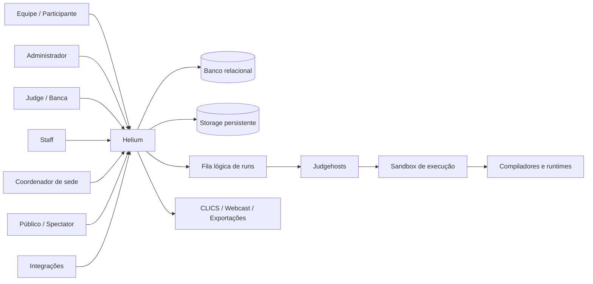

### 2.2.2 Arquitetura em camadas

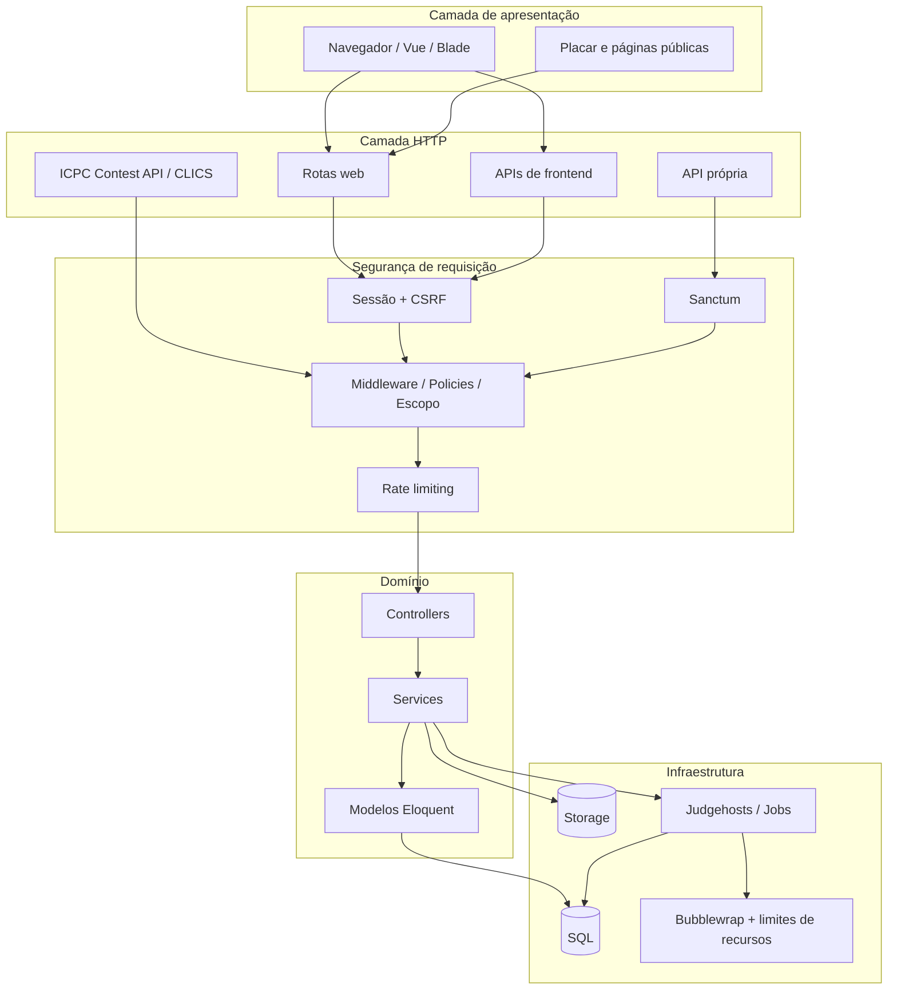

### 2.2.3 Componentes funcionais

```mermaid
flowchart LR
    subgraph Identity[Identidade e acesso]
      Auth[Autenticação]
      Token[Tokens]
      RBAC[RBAC / Policies]
      Privacy[Privacidade]
    end
    subgraph ContestOps[Competição]
      Contest[Contest lifecycle]
      Clock[Contest clock]
      Sites[Sedes]
      Finalize[Finalização / Premiação]
    end
    subgraph Content[Conteúdo]
      Problems[Problemas]
      Bank[Banco de problemas]
      Import[Importação / Exportação]
      Practice[Treino]
    end
    subgraph Judging[Julgamento]
      Runs[Runs]
      Auto[Auto-judge]
      Hosts[Judgehosts]
      Verify[Verificação]
      Rejudge[Rejudging]
    end
    subgraph Experience[Experiência da prova]
      Score[Scoreboard]
      Clar[Clarificações]
      SOS[S.O.S.]
      Tasks[Tarefas / Balões / Impressão]
    end
    subgraph Governance[Governança]
      Audit[Logs / Eventos]
      Reports[Relatórios]
      Similarity[Similaridade]
      Webcast[Webcast / CLICS]
      Backup[Backup]
    end
    Identity --> ContestOps
    ContestOps --> Content
    Content --> Judging
    Judging --> Experience
    Judging --> Governance
    ContestOps --> Governance
```

## 2.3 Regras de Negócio

| ID | Regra |
| --- | --- |
| RN-001 | Todo recurso de competição deve ser avaliado no contexto do contest ao qual pertence; IDs previsíveis não concedem acesso cruzado. |
| RN-002 | Contest de prática deve ser distinguido de competição oficial nas seleções de evento, relógio, ranking, tarefas e publicação. |
| RN-003 | Um contest pode estar configurado sem estar ativo; ativação e horário de início são conceitos distintos. |
| RN-004 | Fim de prova, congelamento, revelação e finalização são estados distintos e não devem ser colapsados em um único booleano. |
| RN-005 | Freeze igual a zero significa ausência de congelamento. |
| RN-006 | Uma vez iniciado o freeze, ele pode persistir após o término da prova até uma operação explícita de revelação. |
| RN-007 | O placar visível a participantes e público deve omitir eventos protegidos pelo freeze; a banca pode acessar visão completa conforme autorização. |
| RN-008 | A finalização deve ocorrer somente quando pendências capazes de alterar o resultado estiverem resolvidas ou explicitamente tratadas. |
| RN-009 | A premiação deve ser derivada de classificação final consolidada e regras de medalhas configuradas. |
| RN-010 | A hora do servidor é a referência canônica para tempo de contest; clientes não devem decidir estados críticos apenas pelo relógio local. |
| RN-011 | Ajustes de tempo devem ser registrados como eventos/entidades auditáveis, e não por reescrita silenciosa do histórico. |
| RN-012 | Ajuste global altera a duração efetiva do contest; ajuste de sede afeta somente a sede correspondente. |
| RN-013 | Uma sede pertence a um contest e pode sobrescrever parâmetros operacionais permitidos, mantendo fallback para configuração do contest. **Não conforme para duração e congelamento: as colunas e os métodos existem, mas nada os chama — #276.** |
| RN-014 | Roteamento de julgamento multi-site deve ser explícito; ausência de rota adicional significa julgamento da própria sede. |
| RN-015 | Restrição de rede de uma sede pode aceitar IPs exatos e faixas CIDR; ausência de regra implica ausência dessa restrição específica. |
| RN-016 | Login de usuário associado a sede restrita deve validar a origem antes de conceder sessão utilizável. |
| RN-017 | Contas associadas a rede restrita não devem contornar validação por sessão persistente que sobreviva ao contexto de rede sem nova checagem. |
| RN-018 | Usuários desabilitados não devem autenticar nem executar operações protegidas. **Não conforme hoje: o login web não consulta `is_enabled` — #277.** |
| RN-019 | Cada usuário deve ter papel explícito compatível com o conjunto de permissões efetivas. |
| RN-020 | Administrador e conta de sistema podem exercer autoridade administrativa; demais papéis recebem apenas capacidades necessárias. |
| RN-021 | Tokens de API pertencem ao usuário e podem ser listados e revogados pelo próprio titular. |
| RN-022 | Credenciais e tokens nunca devem ser retornados ou registrados em texto claro após a emissão quando o contrato não exigir isso. |
| RN-023 | Dados pessoais sensíveis ou desnecessários, incluindo data de nascimento, não devem aparecer em serializações públicas. |
| RN-024 | Políticas de privacidade devem ser centralizadas e aplicadas independentemente do endpoint que serializa o usuário. |
| RN-025 | Problemas pertencem a um contest; enunciado público e material secreto de teste devem permanecer em superfícies diferentes. |
| RN-026 | Inputs, outputs, hashes ou caminhos que permitam reconstruir casos ocultos não devem ser expostos a competidores. |
| RN-027 | Pacotes importados são entrada não confiável; nomes de arquivo devem ser normalizados e não podem permitir path traversal. |
| RN-028 | Limites de tempo, memória e habilitação de auto-judge podem possuir override por linguagem. |
| RN-029 | Pausar julgamento de problema não deve necessariamente bloquear novas submissões; elas podem permanecer enfileiradas até a retomada. |
| RN-030 | Toda run deve manter contest, sede, autor, problema, linguagem, número, origem do código e tempo de contest suficientes para auditoria. |
| RN-031 | Runs são registros append-only do fato de submissão; correção de erro de julgamento ocorre por novo julgamento/rejudging, não por apagar o fato. |
| RN-032 | Submissões idênticas podem ser detectadas por hash conforme política do produto, sem expor fonte de outra equipe. |
| RN-033 | Judgehost deve reivindicar uma run de modo atômico para impedir que dois workers executem a mesma unidade de trabalho simultaneamente. |
| RN-034 | Uma reivindicação de run deve possuir lease/claim token verificável; resultado atrasado de lease antigo não deve sobrescrever trabalho mais novo. |
| RN-035 | Workers presos ou abandonados devem poder ter runs reconciliadas e devolvidas à fila de forma auditável. |
| RN-036 | Código submetido deve executar fora do processo web e sob isolamento que restrinja filesystem, processos, memória e tempo. |
| RN-037 | A raiz da aplicação, segredos e arquivos de configuração não devem ser montados de forma legível dentro do sandbox de submissão. |
| RN-038 | O resultado do auto-judge deve preservar diagnóstico suficiente para banca sem expor detalhes secretos ao participante. |
| RN-039 | Quando verificação manual estiver habilitada no contest, veredito não verificado deve ser retido de participantes, público, webcast e placar público. **Parcial: a Contest API e o event feed não aplicam o gate — #274.** |
| RN-040 | Admin, judge, staff e site podem ver veredito retido somente quando isso for necessário ao papel operacional; equipes e público aguardam liberação. |
| RN-041 | Run com veredito retido não deve alterar classificação visível ao participante. |
| RN-042 | Rejudging em lote deve oferecer prévia/dry-run, motivo e conjunto de runs antes da aplicação. |
| RN-043 | Rejudging deve preservar relação entre resultado anterior, operação de rejulgamento e resultado aplicado. |
| RN-044 | Clarificação pertence a um contest e pode ser vinculada a problema; respostas podem ser direcionadas ou transmitidas conforme regra da banca. |
| RN-045 | Participante só pode consultar clarificações que lhe pertencem ou que tenham sido publicadas/broadcast para sua audiência. |
| RN-046 | S.O.S. é fila operacional distinta da fila de julgamento; uma equipe não deve criar múltiplos chamados simultâneos não resolvidos quando a regra de unicidade estiver ativa. |
| RN-047 | Tarefas operacionais devem registrar responsável, estado e tempo de conclusão quando aplicável. |
| RN-048 | Entrega de balão deve derivar de solve válido e não pode ser confundida com publicação antecipada de resultado protegido. |
| RN-049 | Logs de auditoria devem registrar ações relevantes sem registrar fonte submetida, credenciais, tokens ou dados pessoais desnecessários. |
| RN-050 | Relatórios e exportações devem respeitar a mesma autorização e política de freeze dos dados que representam. |
| RN-051 | Banco de problemas deve possuir política explícita de propriedade e capacidade de edição; UI de capability não substitui autorização no servidor. |
| RN-052 | Transferência de propriedade de problema deve ser autorizada e auditável. |
| RN-053 | Treino livre deve reutilizar mecanismos seguros de problema e julgamento sem ser tratado como competição oficial. |
| RN-054 | Estatísticas de treino associadas a pessoas devem respeitar regras de privacidade. |
| RN-055 | Análise de similaridade deve operar sobre fontes autorizadas e restringir resultados sensíveis à organização/banca. |
| RN-056 | **CLICS** deve aplicar freeze e retenção de veredito antes de publicar dados externos. O **webcast** aplica a retenção de veredito (`BocaWebcastZipBuilder`) e serve o placar **descongelado por desenho** — é a tela da cerimônia, e a decisão está registrada em `docs/specs/44-webcast.md`. Pendências da Contest API em #274. |
| RN-057 | Dados públicos de CLICS podem ser lidos sem conta quando o contrato assim exigir; a ausência de autenticação não elimina as regras de publicação. |
| RN-058 | Operações mutáveis suscetíveis a repetição por falha de rede devem ser idempotentes quando o contrato fornecer Idempotency-Key. |
| RN-059 | Backup deve abranger banco e artefatos necessários para reconstruir o estado operacional; restauração deve ser validada antes de ser considerada concluída. |
| RN-060 | Health checks e watchdogs não devem revelar segredos; devem fornecer sinal suficiente para operação e recuperação. |

## 2.4 Diagrama de Caso de Uso Nível 0

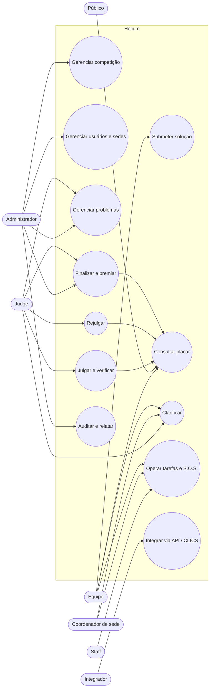


## 2.5 Perspectiva do Produto

O Helium é um sistema de informação centralizado para competição de programação. Ele não é apenas uma interface de placar nem apenas um executor de código: o produto coordena o ciclo de vida completo do evento e mantém uma fonte canônica de verdade para identidade, tempo, submissões, julgamentos, classificação e publicação.

Do ponto de vista arquitetural, o produto é composto por três zonas principais:

1. **plano de controle**, formado pela aplicação web, autenticação, autorização, configuração, banco de dados e serviços de domínio;
2. **plano de execução**, formado por judgehosts, sandbox, toolchains e mecanismos de limitação de recursos;
3. **plano de publicação**, formado por interface pública, scoreboard, relatórios, webcast, API própria e CLICS.

A separação entre essas zonas é normativa: falha ou indisponibilidade de uma superfície de publicação não deve corromper o estado do julgamento; falha de um judgehost não deve alterar arbitrariamente o histórico de submissões; e acesso a uma interface administrativa não deve derivar apenas de visibilidade no frontend.

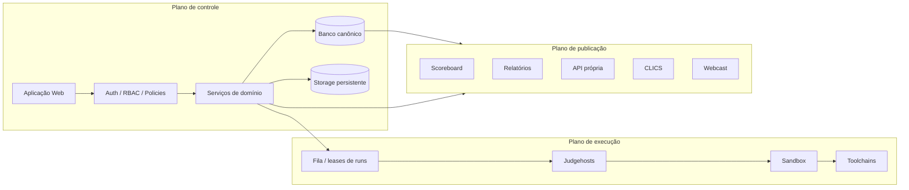

## 2.6 Funções do Produto

Em nível de produto, o Helium deve prover as seguintes funções coesas:

| Grupo | Função | Resultado esperado |
| --- | --- | --- |
| Identidade | autenticar, ativar, habilitar/desabilitar e autorizar contas | somente atores válidos executam ações permitidas |
| Configuração | criar contests, sedes, linguagens, problemas e políticas | evento configurado de modo reproduzível |
| Participação | publicar enunciados e receber submissões | run registrada com contexto e tempo canônico |
| Julgamento | distribuir, executar, classificar e verificar runs | veredito rastreável e tecnicamente reproduzível |
| Classificação | recomputar score, aplicar penalidade, freeze e revelação | ranking coerente com regras do contest |
| Comunicação | clarificações, comunicados, S.O.S. e tarefas | operação humana coordenada e auditável |
| Governança | banco de problemas, organizações, ownership e similaridade | acervo reutilizável sem perda de autoria/controle |
| Fechamento | preflight, finalização, awards e relatórios | resultado consolidado e publicável |
| Integração | API própria, OpenAPI, CLICS e webcast | consumidores externos recebem somente dados permitidos |
| Operação | health, watchdog, backup e restauração | plataforma observável e recuperável |

## 2.7 Classes e Características dos Usuários

| Classe | Conhecimento esperado | Frequência de uso | Sensibilidade operacional |
| --- | --- | --- | --- |
| Team | uso básico de navegador e linguagem de programação | alta durante a prova | alta; erros afetam participação |
| Judge | domínio de competição, problemas e vereditos | alta durante preparação/prova | crítica; ações alteram julgamento |
| Admin | domínio operacional e de configuração | média/alta | crítica; ações alteram todo o evento |
| Staff | treinamento operacional do evento | alta durante a prova | média; afeta logística |
| Site | domínio da operação local | alta em eventos multi-site | alta no escopo local |
| Público | nenhum treinamento | eventual/alta em placar | baixa, mas sujeito a freeze/publicação |
| Integrador | HTTP/JSON e contrato da API | automatizada | alta quando consome dados oficiais |
| Operador | Linux, banco, storage, rede e observabilidade | preparação + incidentes | crítica para disponibilidade |

A interface deve reduzir carga cognitiva para Team e Staff e, ao mesmo tempo, oferecer informação diagnóstica suficiente a Judge, Admin e Operador sem misturar permissões entre papéis.

## 2.8 Ambiente Operacional

O ambiente alvo deve fornecer:

- sistema operacional e runtime compatíveis com as dependências declaradas do projeto;
- servidor web/reverse proxy com HTTPS em produção;
- aplicação PHP/Laravel e workers necessários;
- banco relacional com integridade transacional e concorrência compatível com a escala do evento;
- storage persistente para pacotes, fontes, artefatos e backups;
- Node.js apenas onde necessário ao build/tooling do frontend;
- judgehosts Linux com recursos de isolamento e toolchains instaladas;
- sincronização confiável de relógio entre componentes operacionais;
- resolução DNS, conectividade e capacidade de rede compatíveis com o número de sedes/participantes;
- mecanismo de backup e destino independente do volume primário sempre que possível.

## 2.9 Restrições de Projeto e Implementação

1. O relógio do servidor deve ser a referência para estados críticos.
2. Código submetido não pode ser executado no contexto de confiança da aplicação web.
3. Autorização deve existir no backend, mesmo quando a UI oculta uma ação.
4. Recursos de competição devem carregar escopo de contest e, quando aplicável, de site.
5. Evolução do esquema deve ocorrer por migrations.
6. APIs públicas devem preservar contratos documentados e política de publicação.
7. Freeze, verification gate e finalização devem ser tratados como regras de domínio, não como decoração de interface.
8. Logs não são armazenamento aceitável para segredos ou fonte submetida completa.
9. Recursos externos opcionais não podem ser simulados como disponíveis em produção por fixtures.
10. Dependências externas críticas devem falhar de forma explícita e diagnosticável.

## 2.10 Premissas e Dependências

Esta especificação assume que:

- a organização dispõe de infraestrutura mínima para hospedar a instalação central;
- judgehosts recebem toolchains compatíveis com as linguagens habilitadas;
- organizadores configuram corretamente horários, regras, sedes, problemas e usuários antes do evento;
- a rede entre sede e servidor central permanece disponível durante o fluxo normal de submissão;
- operadores mantêm backups, credenciais e observabilidade adequados ao risco do evento;
- integrações externas respeitam seu próprio contrato e disponibilidade;
- decisões humanas da banca, quando necessárias, são registradas pelo sistema mas permanecem responsabilidade da organização.

Dependências de infraestrutura devem ser tratadas como pré-condições operacionais, não como justificativa para relaxar regras de integridade ou segurança.

## 2.11 Apportioning e Evolução Planejada

Capacidades P0 formam o núcleo mínimo para operar uma competição com integridade. Capacidades P1 e P2 podem ser habilitadas incrementalmente, desde que a interface não anuncie funcionalidade sem backend correspondente e que dependências P0 estejam satisfeitas. Uma função experimental deve possuir gate explícito, estado de indisponibilidade e testes que impeçam ativação acidental em produção.

---

# 3. Requisitos

## 3.1 Requisitos Funcionais

Os requisitos funcionais estão organizados por capacidade de negócio. Cada requisito possui identificador, prioridade e critério verificável. Quando a interface oferece uma capacidade, a autorização correspondente deve ser revalidada no servidor; esconder ou desabilitar um botão nunca é suficiente para cumprir um requisito de segurança.

### F01. Gestão de Competições

**Operação:** CRUD + ciclo de vida  
**Atores:** Administradores; banca em operações delegadas  
**Objetivo:** Criar, configurar, ativar, acompanhar, encerrar, revelar e finalizar contests.

| ID | Prioridade | Requisito | Critério de aceite |
| --- | --- | --- | --- |
| RF-F01-001 | P0 | Permitir criar contest com nome, descrição, início, duração, freeze, penalidade, tamanho máximo de arquivo, visibilidade e parâmetros de premiação. | Persistência valida campos obrigatórios, tipos e faixas; leitura posterior reproduz a configuração. |
| RF-F01-002 | P0 | Permitir ativar e desativar contest sem confundir ativação com início temporal. | Contest ativado antes do horário permanece não iniciado; desativação não revela placar congelado. |
| RF-F01-003 | P0 | Calcular início, fim e freeze usando hora canônica do servidor. | API e UI recebem estado consistente para o mesmo instante. |
| RF-F01-004 | P0 | Permitir encerramento antecipado preservando a política de freeze. | Encerrar não define `unfrozen_at` automaticamente. |
| RF-F01-005 | P0 | Permitir revelar explicitamente o placar congelado. | Após unfreeze, visões públicas e autorizadas convergem para os resultados publicáveis. |
| RF-F01-006 | P0 | Permitir preflight e finalização formal do contest. | Finalização bloqueia ou reporta pendências que podem alterar classificação. |
| RF-F01-007 | P1 | Permitir configurar medalhas e corte/ranking aplicáveis à premiação. | Premiação é derivada deterministicamente da classificação final e parâmetros do contest. |
| RF-F01-008 | P1 | Distinguir competição oficial de contest de prática. | Seletores de competição, relógio e ranking oficial excluem practice quando apropriado. |

### F02. Identidade, Autenticação e Contas

**Operação:** CRUD + autenticação  
**Atores:** Todos os usuários; administrador para gestão  
**Objetivo:** Manter contas seguras e identificáveis para participantes e operadores.

| ID | Prioridade | Requisito | Critério de aceite |
| --- | --- | --- | --- |
| RF-F02-001 | P0 | Autenticar usuário web por credenciais válidas e regenerar a sessão após login. | Credenciais inválidas não criam sessão; login válido altera o identificador de sessão. |
| RF-F02-002 | P0 | Aplicar throttle ao endpoint de credenciais. | Tentativas acima do limite configurado retornam resposta de limitação sem autenticar. |
| RF-F02-003 | P0 | Permitir logout invalidando sessão e regenerando token CSRF. | Sessão anterior não acessa recurso protegido após logout. |
| RF-F02-004 | P0 | Permitir emissão de token de API por credenciais e autenticação subsequente via Sanctum. | Token válido autentica somente como seu titular e pode ser revogado. |
| RF-F02-005 | P0 | Permitir ao usuário listar e revogar os próprios tokens, incluindo o token corrente. | Usuário não lista nem revoga token de outro usuário. |
| RF-F02-006 | P0 | Respeitar estado `is_enabled` da conta. | Conta desabilitada não obtém acesso protegido. **Não conforme no login web — #277.** |
| RF-F02-007 | P1 | Permitir cadastro/gestão de contas com nome, username, e-mail, papel, contest, sede e dados autorizados. | Validações de unicidade e autorização são aplicadas no servidor. |
| RF-F02-008 | P1 | Suportar fluxo de conta gerenciada com ativação por token quando habilitado. | Token de ativação válido conclui o fluxo uma única vez e não vaza em logs. |

### F03. Autorização, Escopo e Privacidade

**Operação:** Policies + middleware  
**Atores:** Todos os perfis  
**Objetivo:** Garantir que identidade autenticada não implique acesso a qualquer recurso.

| ID | Prioridade | Requisito | Critério de aceite |
| --- | --- | --- | --- |
| RF-F03-001 | P0 | Autorizar cada operação por papel e objeto alvo. | Trocar ID por recurso de outro contest/site não concede acesso. |
| RF-F03-002 | P0 | Separar superfície de competidor da superfície de judge/admin na API. | Rotas administrativas devolvem 403 para team autenticado. |
| RF-F03-003 | P0 | Aplicar escopo próprio a runs, clarificações, tokens e dados privados. | Conta participante não consulta registros privados de outra equipe. |
| RF-F03-004 | P0 | Ocultar credenciais, senha, remember token e data de nascimento de serializações públicas. | Testes de serialização não encontram campos proibidos. |
| RF-F03-005 | P0 | Aplicar política central de privacidade a contas com restrições adicionais. | Mesmo dado acessado por endpoints diferentes recebe a mesma decisão de visibilidade. |
| RF-F03-006 | P1 | Permitir visibilidade pública de contest somente quando a configuração permitir. | Contest não público não aparece para visitante sem vínculo. |
| RF-F03-007 | P1 | Registrar negações relevantes de acesso sem registrar segredos. | Log contém contexto suficiente para auditoria e não contém credencial/token. |

### F04. Sedes e Operação Multi-site

**Operação:** CRUD + roteamento  
**Atores:** Administrador; coordenador de sede  
**Objetivo:** Representar sedes em uma instalação central e isolar suas operações.

| ID | Prioridade | Requisito | Critério de aceite |
| --- | --- | --- | --- |
| RF-F04-001 | P0 | Permitir associar sede a contest e configurar nome, estado, login, auto-judge, duração/freeze opcionais e limites operacionais. | Configuração da sede é persistida e aplicada somente ao seu escopo. |
| RF-F04-002 | P0 | Usar valores do contest como fallback quando sede não possui override. | Duração/freeze efetivos correspondem ao contest na ausência de valor local. |
| RF-F04-003 | P0 | Permitir restrição de login por lista de IPs/CIDRs da sede. | IP fora das regras configuradas é bloqueado antes de obter sessão válida. |
| RF-F04-004 | P0 | Permitir roteamento explícito de julgamento entre sedes. | Judge de sede vê sua sede e fontes roteadas, sem abrir todas as sedes por padrão. |
| RF-F04-005 | P0 | Manter uma única fonte canônica de dados para o contest multi-site. | Operações de sedes convergem no mesmo banco/estado central. |
| RF-F04-006 | P1 | Permitir painel de sede com equipes, tarefas, clarificações e S.O.S. locais. | Coordenador não obtém poderes globais ao operar recursos locais. |
| RF-F04-007 | P1 | Permitir configuração de visibilidade de placar e espera máxima de julgamento por sede quando prevista. | Comportamento efetivo respeita configuração local e regras globais mais restritivas. |

### F05. Problemas e Casos de Teste

**Operação:** CRUD + publicação  
**Atores:** Administrador; judge  
**Objetivo:** Gerenciar desafios com enunciado, metadados, testes e limites.

| ID | Prioridade | Requisito | Critério de aceite |
| --- | --- | --- | --- |
| RF-F05-001 | P0 | Permitir criar problema associado a contest com short name, nome, basename, descrição, cor, limites e ordem. | Problema aparece no contest correto e ordenado de forma determinística. |
| RF-F05-002 | P0 | Manter casos de teste vinculados ao problema em ordem explícita. | Auto-judge percorre conjunto correto e não mistura testes de outros problemas. |
| RF-F05-003 | P0 | Separar enunciado publicável dos diretórios/arquivos de teste ocultos. | Team pode baixar statement sem receber inputs/outputs ocultos. |
| RF-F05-004 | P0 | Normalizar caminho de arquivo de enunciado proveniente de pacote. | Valores com `../` não escapam do diretório permitido. |
| RF-F05-005 | P0 | Permitir pausar e retomar julgamento de um problema sem apagar submissões. | Novas runs podem ser registradas e aguardam processamento enquanto pausado. |
| RF-F05-006 | P1 | Permitir problema fake quando necessário ao modelo operacional. | Flag não altera silenciosamente problemas normais. |
| RF-F05-007 | P1 | Permitir reordenar problemas sem alterar identidade histórica. | Short name/ID continuam estáveis após mudança de sort order. |

### F06. Banco de Problemas e Pacotes

**Operação:** CRUD + import/export  
**Atores:** Administrador; editores autorizados  
**Objetivo:** Reutilizar problemas com governança de propriedade.

| ID | Prioridade | Requisito | Critério de aceite |
| --- | --- | --- | --- |
| RF-F06-001 | P0 | Permitir importar pacote de problema validando estrutura e arquivos antes de publicação. | Pacote inválido falha sem deixar problema parcialmente utilizável. |
| RF-F06-002 | P0 | Permitir importar formatos suportados sem expor conteúdo secreto ao participante. | Após importação, apenas statement publicável fica na superfície de team. |
| RF-F06-003 | P0 | Permitir exportar pacote completo somente para perfis autorizados. | Team recebe 403 ao tentar exportar material de julgamento. |
| RF-F06-004 | P1 | Manter banco de problemas independente do vínculo imediato com um contest. | Problema do banco pode ser selecionado/reutilizado conforme policy. |
| RF-F06-005 | P1 | Associar ownership a usuário/organização conforme política vigente. | Somente owner/editor/admin autorizado altera item governado. |
| RF-F06-006 | P1 | Registrar transferência de propriedade. | Transferência contém origem, destino, ator e instante auditáveis. |
| RF-F06-007 | P1 | Permitir etiquetas/metadados de organização do acervo quando habilitados. | Filtros não alteram permissão do objeto. |

### F07. Linguagens e Limites de Execução

**Operação:** CRUD + configuração  
**Atores:** Administrador; judge  
**Objetivo:** Configurar linguagens aceitas e limites efetivos por problema.

| ID | Prioridade | Requisito | Critério de aceite |
| --- | --- | --- | --- |
| RF-F07-001 | P0 | Manter linguagens habilitadas por contest com configuração de compilação/execução suportada. | Submissão só aceita linguagem autorizada para o contest. |
| RF-F07-002 | P0 | Aplicar limite de tempo e memória padrão do problema. | Worker recebe limites do problema quando não há override. |
| RF-F07-003 | P0 | Permitir override de tempo, memória e auto-judge por problema/linguagem. | Override prevalece somente para o par problema-linguagem correspondente. |
| RF-F07-004 | P0 | Recusar execução quando toolchain configurada não está disponível de forma segura. | Falha operacional não é convertida silenciosamente em Wrong Answer. |
| RF-F07-005 | P1 | Permitir inspeção administrativa das linguagens e limites efetivos. | Banca consegue explicar quais limites serão usados antes de uma run. |

### F08. Submissões e Runs

**Operação:** Create + read  
**Atores:** Team; admin em cenários operacionais  
**Objetivo:** Registrar cada tentativa com integridade e rastreabilidade.

| ID | Prioridade | Requisito | Critério de aceite |
| --- | --- | --- | --- |
| RF-F08-001 | P0 | Permitir submeter fonte apenas a problema e linguagem autorizados no contest vigente. | Request fora do escopo falha antes de criar run válida. |
| RF-F08-002 | P0 | Persistir run com contest, site, usuário, problema, linguagem, número, source file/hash, contest time e estado. | Registro contém chaves suficientes para reconstruir contexto da tentativa. |
| RF-F08-003 | P0 | Gerar numeração de run coerente no escopo contest/sede. | Duas runs concorrentes não recebem identidade operacional ambígua. |
| RF-F08-004 | P0 | Preservar fonte submetida de forma privada e autorizada. | Participante acessa própria fonte; acesso a fonte alheia exige papel apropriado. |
| RF-F08-005 | P0 | Detectar submissão duplicada quando a política estiver habilitada. | Duplicata é identificada pelo hash sem comparar/expor fonte de terceiros ao usuário. |
| RF-F08-006 | P0 | Não permitir edição/destruição arbitrária de run por participante. | Correções de julgamento criam trilha de rejudge em vez de apagar a tentativa. |
| RF-F08-007 | P1 | Exibir estado e tempo de contest da run ao usuário autorizado. | Formato da UI corresponde ao valor persistido/canônico. |

### F09. Auto-judge e Judgehosts

**Operação:** Fila distribuída  
**Atores:** Administrador; judge; worker  
**Objetivo:** Executar código submetido de forma isolada, concorrente e recuperável.

| ID | Prioridade | Requisito | Critério de aceite |
| --- | --- | --- | --- |
| RF-F09-001 | P0 | Executar código não confiável somente em sandbox configurado para esse fim. | Worker recusa execução insegura quando isolamento obrigatório não está disponível. |
| RF-F09-002 | P0 | Impedir leitura da raiz da aplicação, `.env`, segredos e storage não autorizado dentro do sandbox. | Teste adversarial não consegue ler caminhos proibidos. |
| RF-F09-003 | P0 | Aplicar limites de tempo e memória efetivos ao processo submetido. | Processo excedente é encerrado e classificado conforme regra de julgamento. |
| RF-F09-004 | P0 | Reivindicar run atomicamente com judgehost, horário e claim token. | Dois workers não processam a mesma lease válida ao mesmo tempo. |
| RF-F09-005 | P0 | Rejeitar resultado devolvido com claim token obsoleto. | Lease antiga não sobrescreve julgamento posterior. |
| RF-F09-006 | P0 | Permitir devolver/reconciliar run presa preservando motivo e contadores. | Run volta ao estado elegível sem perder histórico de tentativa operacional. |
| RF-F09-007 | P1 | Registrar wall time e CPU time medidos quando disponíveis. | Métricas ficam associadas à run julgada e são acessíveis à banca. **Não conforme no julgamento remoto: o contrato de resultado não carrega os tempos, e a calibração fica sem dado — #273.** |
| RF-F09-008 | P1 | Manter capacidades por judgehost para roteamento/diagnóstico. | Admin consegue distinguir host indisponível de incompatibilidade de capacidade. |
| RF-F09-009 | P1 | Expor health operacional sem segredos. | Tela/API mostra estado útil sem tokens, fontes ou credenciais. |

### F10. Julgamento Manual e Verificação

**Operação:** Update controlado  
**Atores:** Judge; administrador  
**Objetivo:** Permitir decisão humana e gate de publicação de veredito.

| ID | Prioridade | Requisito | Critério de aceite |
| --- | --- | --- | --- |
| RF-F10-001 | P0 | Permitir judge atribuir/alterar veredito de run autorizada com trilha de autoria. | `judge_id`, momento e resultado são recuperáveis. |
| RF-F10-002 | P0 | Quando `verification_required` estiver ativo, reter veredito até verificação. | Team, público, webcast e placar público não inferem o resultado antes da verificação. |
| RF-F10-003 | P0 | Permitir verificar run registrando verifier, instante e comentário opcional. | Após verify, resultado torna-se visível conforme demais regras. |
| RF-F10-004 | P0 | Permitir retirar verificação quando autorizado e necessário. | Resultado volta a ser retido e placar é recomputado de modo consistente. |
| RF-F10-005 | P0 | Separar identidade do judge da identidade do verifier. | Auditoria distingue quem julgou de quem liberou. |
| RF-F10-006 | P1 | Permitir banca inspecionar stdout/stderr e diagnósticos autorizados. | Detalhes secretos permanecem ausentes da resposta para team. |

### F11. Rejulgamento

**Operação:** Workflow rastreável  
**Atores:** Judge; administrador  
**Objetivo:** Reprocessar runs sem destruir o histórico do concurso.

| ID | Prioridade | Requisito | Critério de aceite |
| --- | --- | --- | --- |
| RF-F11-001 | P0 | Permitir rejulgar uma run individual autorizada. | Novo resultado é produzido sem remover o registro de submissão. |
| RF-F11-002 | P0 | Permitir criar conjunto de rejudging em lote com filtro e motivo. | Conjunto alvo é materializado/auditável antes da aplicação. |
| RF-F11-003 | P0 | Fornecer dry-run/preview antes de aplicar lote. | Usuário visualiza quantidade e escopo afetado antes da confirmação. |
| RF-F11-004 | P0 | Permitir excluir accepted do lote por padrão ou conforme opção explícita. | Critério de inclusão é mostrado e testável. |
| RF-F11-005 | P0 | Permitir aplicar e cancelar rejudging conforme estado. | Transições inválidas retornam erro sem efeito parcial indevido. |
| RF-F11-006 | P0 | Recalcular score e visibilidade após aplicação. | Placar reflete somente resultados atualmente válidos e publicáveis. |

### F12. Pontuação, Scoreboard, Freeze e Revelação

**Operação:** Read + cálculo  
**Atores:** Todos; visão varia por papel  
**Objetivo:** Produzir classificação determinística e segura.

| ID | Prioridade | Requisito | Critério de aceite |
| --- | --- | --- | --- |
| RF-F12-001 | P0 | Calcular score a partir de runs julgadas válidas para pontuação. | Run pending/judging ou sem answer não altera score. |
| RF-F12-002 | P0 | Aplicar penalidade do contest conforme regra de scoring configurada. | Mesmo conjunto de runs gera mesmo total de solved/penalty. |
| RF-F12-003 | P0 | Excluir vereditos retidos por verification gate do placar visível a participantes. | Rank não se move antes de verify. |
| RF-F12-004 | P0 | Aplicar freeze temporal à visão pública/competidor. | Solve dentro da janela protegida não é revelado antecipadamente. |
| RF-F12-005 | P0 | Manter freeze após fim até unfreeze explícito. | Fim do relógio não publica classificação completa automaticamente. |
| RF-F12-006 | P1 | Permitir exportação de scoreboard para perfis autorizados. | Export interno pode conter visão completa somente quando policy permitir. |
| RF-F12-007 | P1 | Permitir estatísticas do contest sem quebrar freeze/privacidade. | Métrica pública não funciona como canal lateral de resultado oculto. |
| RF-F12-008 | P1 | Permitir consulta de `my-score` sem expor dados de outras equipes. | Resposta é limitada ao usuário/escopo autenticado. |

### F13. Clarificações e Comunicados

**Operação:** Create + read + answer  
**Atores:** Team; judge; site conforme escopo  
**Objetivo:** Mediar perguntas técnicas e respostas da banca.

| ID | Prioridade | Requisito | Critério de aceite |
| --- | --- | --- | --- |
| RF-F13-001 | P0 | Permitir team criar clarificação vinculada ao contest e opcionalmente ao problema. | Pergunta é registrada com autor, tempo de contest e categoria quando aplicável. |
| RF-F13-002 | P0 | Permitir judge listar fila pendente e responder clarificação. | Resposta registra ator e instante. |
| RF-F13-003 | P0 | Restringir leitura de pergunta privada ao autor e perfis autorizados. | Outra equipe não acessa clarificação privada por ID direto. |
| RF-F13-004 | P0 | Permitir broadcast/publicação de resposta quando a banca decidir. | Mensagem publicada passa a ser visível à audiência definida. |
| RF-F13-005 | P1 | Permitir categorias para triagem. | Categoria não altera autorização e pode ser filtrada pela banca. |
| RF-F13-006 | P1 | Permitir coordenador de sede tratar clarificações dentro do escopo permitido. | Ação local não acessa contest/sede não roteado. |

### F14. Operação: Tarefas, Impressão, Balões e S.O.S.

**Operação:** Filas operacionais  
**Atores:** Team; staff; site; admin  
**Objetivo:** Apoiar logística sem misturar fila operacional com julgamento.

| ID | Prioridade | Requisito | Critério de aceite |
| --- | --- | --- | --- |
| RF-F14-001 | P0 | Permitir team abrir S.O.S. dentro do contest/sede. | Chamado contém origem, estado e tempo; duplicidade não resolvida é impedida quando configurada. |
| RF-F14-002 | P0 | Permitir staff/site reconhecer e resolver S.O.S. autorizado. | Transições de estado registram ator e instante. |
| RF-F14-003 | P1 | Permitir criação/execução de tarefas operacionais. | Conclusão registra responsável e tempo quando disponível. |
| RF-F14-004 | P1 | Permitir envio de solicitação de impressão com arquivo validado e rate limit. | Upload fora da política falha sem criar tarefa utilizável. |
| RF-F14-005 | P1 | Gerar tarefa/indicador de balão a partir de solve elegível. | Mesmo solve não produz duplicações indevidas. |
| RF-F14-006 | P1 | Permitir download de arquivo de tarefa somente a staff/admin autorizado. | URL direta não bypassa role/escopo. |

### F15. Auditoria e Eventos

**Operação:** Append / read autorizado  
**Atores:** Admin; judge; staff conforme escopo  
**Objetivo:** Reconstruir decisões e acontecimentos relevantes.

| ID | Prioridade | Requisito | Critério de aceite |
| --- | --- | --- | --- |
| RF-F15-001 | P0 | Registrar ações críticas de contest, julgamento, autenticação bloqueada e operações administrativas. | Log inclui contest, ator, ação, tempo e contexto mínimo. |
| RF-F15-002 | P0 | Não registrar senha, token, fonte completa ou dados pessoais desnecessários. | Testes de log não encontram classes de segredo proibidas. |
| RF-F15-003 | P0 | Registrar eventos de contest necessários a feeds e reconstrução temporal. | Evento possui tipo, sequência/tempo e payload controlado. |
| RF-F15-004 | P1 | Permitir consulta de log por perfis autorizados com escopo. | Staff não recebe dados globais ou IP sensível quando contrato o restringe. |
| RF-F15-005 | P1 | Preservar correlação entre rejudging, runs, finalização e ajustes. | Auditor navega do evento à entidade que o originou. |

### F16. Relatórios e Exportações

**Operação:** Read / geração  
**Atores:** Admin; judge; staff/site conforme relatório  
**Objetivo:** Transformar dados operacionais em artefatos verificáveis.

| ID | Prioridade | Requisito | Critério de aceite |
| --- | --- | --- | --- |
| RF-F16-001 | P1 | Gerar relatório de competição com dados autorizados. | Relatório é consistente com estado atual e regras de visibilidade. |
| RF-F16-002 | P1 | Gerar histórico de julgamento para banca. | Filtro por contest e escopo impede mistura de eventos. |
| RF-F16-003 | P1 | Gerar relatório de sede para staff/site. | Conteúdo fica limitado à sede autorizada. |
| RF-F16-004 | P1 | Exportar scoreboard/estatísticas em formatos suportados. | Exportação preserva freeze quando consumida por audiência pública. |
| RF-F16-005 | P1 | Permitir relatórios de premiação após preflight/finalização. | Artefato identifica classificação usada e não inventa colocação ausente. |

### F17. Finalização e Premiação

**Operação:** Workflow  
**Atores:** Admin; judge conforme autorização  
**Objetivo:** Fechar o contest de forma explícita e reprodutível.

| ID | Prioridade | Requisito | Critério de aceite |
| --- | --- | --- | --- |
| RF-F17-001 | P0 | Executar preflight de finalização. | Resposta lista blockers/warnings como runs pendentes, rejudgings ou verificações exigidas. |
| RF-F17-002 | P0 | Bloquear finalização quando condição obrigatória não é atendida. | Nenhum `finalized_at` é gravado em falha. |
| RF-F17-003 | P0 | Registrar quem e quando finalizou. | Contest final possui `finalized_at` e ator quando disponível. |
| RF-F17-004 | P0 | Derivar awards da classificação consolidada e parâmetros do contest. | Awards são reproduzíveis a partir dos mesmos dados. |
| RF-F17-005 | P1 | Permitir consultar premiação antes da assinatura final em superfície restrita. | Banca pode validar resultado sem publicá-lo. |
| RF-F17-006 | P1 | Publicar awards por integração somente quando estado permitir. | CLICS/webcast não expõem premiação prematura. |

### F18. Ajustes de Tempo

**Operação:** CRUD auditável  
**Atores:** Judge; admin  
**Objetivo:** Compensar interrupções globais ou locais sem corromper o relógio histórico.

| ID | Prioridade | Requisito | Critério de aceite |
| --- | --- | --- | --- |
| RF-F18-001 | P0 | Permitir criar ajuste com intervalo/duração, motivo e escopo global ou sede. | Validação rejeita duração inválida e referência a sede de outro contest. |
| RF-F18-002 | P0 | Somar ajustes globais ao fim efetivo do contest. | End time calculado reflete segundos/minutos removidos da prova. |
| RF-F18-003 | P0 | Aplicar ajuste local somente ao relógio da sede. | Outras sedes mantêm fim efetivo original. |
| RF-F18-004 | P0 | Usar tempo efetivo no cálculo de contest time para operações relevantes. | Runs e decisões de tempo usam serviço canônico. |
| RF-F18-005 | P1 | Permitir remover ajuste autorizado com recomputação consistente. | Estado temporal volta ao valor derivado dos ajustes restantes. |

### F19. Treino Livre

**Operação:** Publicação + submissão  
**Atores:** Usuários elegíveis; admin/editor  
**Objetivo:** Oferecer prática reutilizando infraestrutura segura de problemas/julgamento.

| ID | Prioridade | Requisito | Critério de aceite |
| --- | --- | --- | --- |
| RF-F19-001 | P1 | Publicar problemas elegíveis para treino sem convertê-los em competição oficial. | Contest de prática permanece excluído de ranking/tarefas oficiais. |
| RF-F19-002 | P1 | Permitir resolver problema de treino com pipeline de julgamento seguro. | Run de treino usa isolamento e limites como qualquer run. |
| RF-F19-003 | P1 | Manter histórico de prática do usuário autenticado. | Usuário consulta somente seu histórico privado salvo regra de publicação. |
| RF-F19-004 | P1 | Respeitar privacidade em estatísticas pessoais de treino. | Perfil bloqueado não vira público por participar de prática. |
| RF-F19-005 | P2 | Permitir navegação pública de catálogo quando publicação e privacidade permitirem. | Problema não publicado continua 404/negado. |

### F20. Organizações e Governança

**Operação:** CRUD + membership  
**Atores:** Administrador; editores autorizados  
**Objetivo:** Governar autoria e manutenção de acervo compartilhado.

| ID | Prioridade | Requisito | Critério de aceite |
| --- | --- | --- | --- |
| RF-F20-001 | P1 | Permitir criar e administrar organizações. | Nome/identidade da organização são persistentes e únicos conforme regra. |
| RF-F20-002 | P1 | Permitir gerenciar memberships e papel de editor. | Somente autoridade administrativa altera membership de governança. |
| RF-F20-003 | P1 | Permitir usar organização como owner de item do banco. | Policy resolve permissão pela membership corrente. |
| RF-F20-004 | P1 | Impedir autoelevação de privilégio por editor. | Editor não promove a si próprio nem altera membership administrativa. |
| RF-F20-005 | P1 | Auditar mudança de ownership. | Evento/registro identifica ator e transação de origem/destino. |

### F21. Análise de Similaridade

**Operação:** Job assíncrono  
**Atores:** Admin; banca autorizada  
**Objetivo:** Detectar similaridade de fontes sem abrir código a público.

| ID | Prioridade | Requisito | Critério de aceite |
| --- | --- | --- | --- |
| RF-F21-001 | P1 | Permitir solicitar análise para conjunto autorizado de submissões. | Job contém contest/escopo e não aceita fonte fora da autorização. |
| RF-F21-002 | P1 | Executar ferramenta de similaridade em job separado da requisição web. | Criação retorna estado rastreável; processamento pode continuar assíncrono. |
| RF-F21-003 | P1 | Persistir check, estado e pares/resultados relevantes. | Reabertura da página consulta o mesmo job sem recriar análise. |
| RF-F21-004 | P1 | Restringir pares e fontes relacionadas à banca/admin. | Team e público não recebem resultado sensível. |
| RF-F21-005 | P2 | Permitir filtragem/ordenação de pares por score. | Filtros são determinísticos e não mudam o resultado bruto. |

### F22. Webcast e Publicação Externa

**Operação:** Credenciais + export  
**Atores:** Administrador; consumidores externos  
**Objetivo:** Publicar dados controlados sem romper freeze ou privacidade.

| ID | Prioridade | Requisito | Critério de aceite |
| --- | --- | --- | --- |
| RF-F22-001 | P0 | Aplicar o verification gate aos dados externos. | Webcast não revela veredito retido. O placar servido é **descongelado por desenho** — ver RN-056. |
| RF-F22-002 | P1 | Permitir emitir e revogar credenciais de webcast. | Credencial revogada deixa de autorizar acesso imediatamente ou dentro do TTL definido. |
| RF-F22-003 | P1 | Restringir capacidade de exportação a credenciais explicitamente autorizadas. | Credencial somente-leitura não baixa artefato de export. |
| RF-F22-004 | P1 | Gerar exportação BOCA/webcast somente quando consumidor/formato suportado estiver habilitado. | Feature indisponível retorna estado explícito, não dados fictícios. |
| RF-F22-005 | P1 | Não expor fonte, nascimento, tokens ou paths internos em webcast. | Contrato externo contém somente campos aprovados. |

### F23. API Própria e OpenAPI

**Operação:** REST  
**Atores:** Usuários autenticados; público em endpoints definidos  
**Objetivo:** Oferecer contrato programático consistente para o Helium.

| ID | Prioridade | Requisito | Critério de aceite |
| --- | --- | --- | --- |
| RF-F23-001 | P0 | Expor autenticação por token e recursos de competidor sob Sanctum. | Request sem token a rota protegida retorna 401. |
| RF-F23-002 | P0 | Aplicar role gates distintos para competidor, judge/admin e admin. | Matriz de autorização é coberta por testes de rota. |
| RF-F23-003 | P0 | Usar status HTTP coerentes para sucesso, validação, autenticação, autorização, conflito e throttle. | Testes de contrato validam códigos esperados. |
| RF-F23-004 | P1 | Publicar especificação OpenAPI acessível em rota documentada. | Arquivo retornado possui Content-Type apropriado e descreve superfícies suportadas. |
| RF-F23-005 | P1 | Fornecer health endpoint sem autenticação quando apropriado. | Resposta mínima indica saúde sem divulgar configuração sensível. |
| RF-F23-006 | P1 | Fornecer estado do contest corrente com server time. | Cliente pode renderizar timer sem depender exclusivamente do relógio local. |

### F24. ICPC Contest API / CLICS

**Operação:** REST interoperável  
**Atores:** Público; staff autenticado para visão privilegiada  
**Objetivo:** Oferecer recursos de contest em formato interoperável.

| ID | Prioridade | Requisito | Critério de aceite |
| --- | --- | --- | --- |
| RF-F24-001 | P0 | Expor contest, state, problems, teams, organizations, groups, languages e judgement-types conforme contrato suportado. | Recursos usam IDs e relacionamentos consistentes. |
| RF-F24-002 | P0 | Expor submissions e judgements respeitando freeze e verification gate. | Cliente anônimo não reconstrói resultado oculto. |
| RF-F24-003 | P0 | Expor scoreboard com visão adequada à audiência. | Mesmo endpoint pode fornecer visão completa apenas a staff autenticado/autorizado. |
| RF-F24-004 | P1 | Expor awards somente quando estado de finalização/publicação permitir. | Antes disso recurso não entrega premiação definitiva. |
| RF-F24-005 | P1 | Expor event-feed ordenável/consumível por resolver. | Eventos têm sequência/tempo estáveis e não violam freeze. |
| RF-F24-006 | P1 | Expor endpoint access/capabilities compatível com contrato. | Consumidor consegue descobrir recursos suportados sem inferir autorização inexistente. |

### F25. Saúde, Backup e Operação

**Operação:** Operações de infraestrutura  
**Atores:** Administrador; operador  
**Objetivo:** Permitir operar e recuperar a plataforma com segurança.

| ID | Prioridade | Requisito | Critério de aceite |
| --- | --- | --- | --- |
| RF-F25-001 | P0 | Disponibilizar health check da aplicação. | Monitor recebe resposta simples sem segredo quando processo está saudável. |
| RF-F25-002 | P0 | Monitorar runs presas e condições anormais de julgamento. | Watchdog identifica status pending/judging acima do limite operacional configurado. |
| RF-F25-003 | P0 | Permitir reconciliar trabalho abandonado com limites de tentativa. | Loop de falha não gera retentativa infinita sem evidência. |
| RF-F25-004 | P0 | Produzir backup do banco e artefatos necessários à recuperação. | Manifesto/resultado permite verificar o conjunto protegido. |
| RF-F25-005 | P0 | Validar restauração antes de declará-la pronta para competição. | Smoke check confirma banco, storage, login e recursos críticos. |
| RF-F25-006 | P1 | Expor diagnóstico de judgehosts e capacidades para administradores. | Host pode ser habilitado/desabilitado sem editar banco manualmente. |
| RF-F25-007 | P1 | Fornecer comandos/rotinas operacionais idempotentes quando repetição for plausível. | Reexecutar rotina segura não duplica efeito irreversível. |

## 3.2 Requisitos Não-Funcionais

Os requisitos não-funcionais são transversais. Em caso de conflito, requisitos de **segurança, integridade do contest e privacidade** prevalecem sobre conveniência de interface.

### 3.2.1 Usabilidade

| ID | Prioridade | Requisito não-funcional |
| --- | --- | --- |
| RNF-USA-001 | P1 | Operações críticas devem apresentar ação principal inequívoca, consequência e confirmação quando irreversíveis ou de alto impacto. |
| RNF-USA-002 | P1 | Erros de validação devem ser associados ao campo correspondente e o foco deve ir ao primeiro erro relevante. |
| RNF-USA-003 | P1 | A interface deve preservar dados digitados quando uma submissão de formulário falhar de maneira recuperável. |
| RNF-USA-004 | P1 | Estados vazio, carregando, indisponível, sem permissão e erro devem ser distinguíveis; ausência de dado não deve ser mostrada como zero inventado. |
| RNF-USA-005 | P1 | Operações assíncronas devem mostrar identificador/estado suficiente para consulta posterior em vez de simular conclusão. |
| RNF-USA-006 | P2 | Filtros e paginação devem preservar parâmetros relevantes na URL quando isso melhorar navegação e compartilhamento seguro. |

### 3.2.2 Confiabilidade

| ID | Prioridade | Requisito não-funcional |
| --- | --- | --- |
| RNF-CON-001 | P0 | Uma run confirmada deve permanecer recuperável mesmo após falha posterior de julgamento. |
| RNF-CON-002 | P0 | Claim de judgehost deve ser atômico e resistente a concorrência entre workers. |
| RNF-CON-003 | P0 | Resultado de lease obsoleta não deve substituir resultado de lease vigente. |
| RNF-CON-004 | P0 | Operações críticas devem usar transação quando múltiplas escritas precisam ser confirmadas ou revertidas como unidade. |
| RNF-CON-005 | P0 | Backup sem teste de restauração não deve ser considerado evidência suficiente de recuperabilidade. |
| RNF-CON-006 | P1 | A aplicação deve possuir health check e diagnóstico de fila/judgehosts para detecção de falhas antes ou durante a prova. |
| RNF-CON-007 | P1 | Finalização e recomputação de score devem ser determinísticas para o mesmo conjunto de dados. |

### 3.2.3 Desempenho

| ID | Prioridade | Requisito não-funcional |
| --- | --- | --- |
| RNF-DES-001 | P0 | Trabalho pesado de similaridade, julgamento, geração extensa ou reconciliação deve ocorrer fora da requisição síncrona quando aplicável. |
| RNF-DES-002 | P1 | APIs paginadas devem limitar quantidade máxima de itens por resposta; o contrato de frontend usa 20 por página e limite máximo de 100 quando aplicável. |
| RNF-DES-003 | P1 | Cliente web deve tratar 20 segundos como limite operacional de espera para requisições comuns do contrato de frontend, sem assumir que jobs terminaram nesse intervalo. |
| RNF-DES-004 | P0 | Produção com múltiplos workers de julgamento deve utilizar banco adequado a concorrência de escrita; SQLite não é alvo de escalabilidade de competição. |
| RNF-DES-005 | P1 | Consultas de scoreboard, fila e relatórios devem evitar N+1 e leituras de fontes/casos de teste quando esses dados não são necessários. |
| RNF-DES-006 | P1 | A quantidade de workers deve poder crescer até o limite útil de CPU/memória sem violar exclusividade de claim. |

### 3.2.4 Suportabilidade e Manutenibilidade

| ID | Prioridade | Requisito não-funcional |
| --- | --- | --- |
| RNF-SUP-001 | P0 | Alterações de esquema devem ser feitas por migrations versionadas e reversíveis quando tecnicamente seguro. |
| RNF-SUP-002 | P1 | Regras críticas compartilhadas devem possuir uma fonte de verdade em model/service/policy em vez de duplicação entre controllers. |
| RNF-SUP-003 | P1 | Novas rotas protegidas devem entrar em testes que enumeram a superfície e verificam autorização. |
| RNF-SUP-004 | P1 | Código PHP deve ser verificável por suíte de testes, análise estática e formatter/linter adotados no repositório. |
| RNF-SUP-005 | P1 | Frontend deve ter build reproduzível e testes de comportamento/contrato para componentes críticos. |
| RNF-SUP-006 | P1 | Configurações operacionais devem estar em ambiente/config, não hard-coded em componentes de apresentação. |
| RNF-SUP-007 | P2 | Decisões arquiteturais relevantes devem ser documentadas em `docs/` próximas ao código que governam. |

### 3.2.5 Restrições de Design

| ID | Prioridade | Requisito não-funcional |
| --- | --- | --- |
| RNF-RES-001 | P0 | Backend deve operar sobre PHP compatível com `^8.3` e Laravel compatível com `^13.0` enquanto estes forem os requisitos declarados do projeto. |
| RNF-RES-002 | P0 | Frontend deve usar runtime Node compatível com `>=22.15` para o toolchain declarado. |
| RNF-RES-003 | P0 | API autenticada deve usar Laravel Sanctum e autorização adicional por papel/objeto; autenticação sozinha não autoriza mutações administrativas. |
| RNF-RES-004 | P0 | Execução de submissão deve ocorrer em judgehost/sandbox, não dentro do worker web sem isolamento. |
| RNF-RES-005 | P0 | Multi-site deve compartilhar instalação central; `site_id` é particionamento lógico e operacional, não cópia completa da aplicação. |
| RNF-RES-006 | P1 | Interface deve manter a arquitetura atual baseada em Vue/Vite/Tailwind ou mudança equivalente aprovada com migração explícita. |

### 3.2.6 Segurança

| ID | Prioridade | Requisito não-funcional |
| --- | --- | --- |
| RNF-SEG-001 | P0 | Senhas devem ser armazenadas por hash apropriado e nunca retornadas por API. |
| RNF-SEG-002 | P0 | Sessões web mutáveis devem exigir proteção CSRF. |
| RNF-SEG-003 | P0 | Endpoints de credenciais e operações abusáveis devem aplicar rate limit. |
| RNF-SEG-004 | P0 | Autorização deve ser validada no servidor a cada operação, inclusive após UI apresentar capability positiva. |
| RNF-SEG-005 | P0 | Uploads e pacotes devem ser tratados como entrada não confiável, com validação de tamanho, tipo, nome e path. |
| RNF-SEG-006 | P0 | Sandbox de submissão deve aplicar princípio de menor privilégio, filesystem mínimo, sem segredos e com limites de recursos. |
| RNF-SEG-007 | P0 | Respostas privadas e exportações sensíveis devem usar política de cache que evite armazenamento indevido quando aplicável. |
| RNF-SEG-008 | P0 | Mensagens de erro ao cliente não devem incluir stack trace, segredo, path sensível ou conteúdo oculto de teste. |
| RNF-SEG-009 | P1 | Chaves de idempotência devem ser vinculadas a ator, rota e payload para impedir replay com conteúdo diferente. |

### 3.2.7 Privacidade e Proteção de Dados

| ID | Prioridade | Requisito não-funcional |
| --- | --- | --- |
| RNF-PRI-001 | P0 | Coletar e expor somente dados pessoais necessários ao propósito da funcionalidade. |
| RNF-PRI-002 | P0 | Data de nascimento deve permanecer oculta em serialização genérica e pública. |
| RNF-PRI-003 | P0 | Perfil com privacy lock não deve se tornar público implicitamente por participação em treino, ranking ou integração. |
| RNF-PRI-004 | P0 | Logs não devem armazenar tokens, senhas, fontes completas ou data de nascimento. |
| RNF-PRI-005 | P1 | Exportações devem documentar audiência e finalidade; campos não necessários devem ser omitidos. |

### 3.2.8 Observabilidade e Auditabilidade

| ID | Prioridade | Requisito não-funcional |
| --- | --- | --- |
| RNF-OBS-001 | P0 | Eventos críticos devem registrar timestamp do servidor, ator, contest e tipo de ação quando aplicável. |
| RNF-OBS-002 | P0 | Runs devem registrar tempos e estados suficientes para diagnosticar fila, execução e julgamento. |
| RNF-OBS-003 | P1 | Judgehosts devem reportar estado/capacidades de forma útil à operação. |
| RNF-OBS-004 | P1 | Health e watchdog devem distinguir indisponibilidade da aplicação, fila presa e ausência/incapacidade de judgehost. |
| RNF-OBS-005 | P1 | Relatórios de auditoria devem ser reproduzíveis sem depender exclusivamente de logs efêmeros de processo. |

### 3.2.9 Acessibilidade

| ID | Prioridade | Requisito não-funcional |
| --- | --- | --- |
| RNF-ACE-001 | P1 | Toda funcionalidade essencial deve ser operável por teclado. |
| RNF-ACE-002 | P1 | Foco visível deve existir em controles interativos. |
| RNF-ACE-003 | P1 | Informação não deve depender somente de cor; estados devem possuir texto, ícone ou semântica adicional. |
| RNF-ACE-004 | P1 | Campos devem possuir labels associados e mensagens de erro acessíveis. |
| RNF-ACE-005 | P1 | Contraste de texto e controles deve atender ao padrão de acessibilidade adotado pelo projeto. |
| RNF-ACE-006 | P2 | Layout deve permanecer utilizável em larguras móveis e desktop previstas nos testes de frontend. |

### 3.2.10 Interoperabilidade e Portabilidade

| ID | Prioridade | Requisito não-funcional |
| --- | --- | --- |
| RNF-INT-001 | P1 | API própria deve fornecer JSON estável e especificação OpenAPI mantida. |
| RNF-INT-002 | P1 | CLICS deve manter semântica compatível com a Contest API adotada, sem romper políticas locais de publicação. |
| RNF-INT-003 | P1 | Datas e horários em APIs devem usar formato inequívoco com timezone; UI converte para apresentação local. |
| RNF-INT-004 | P1 | Ambiente deve ser implantável por configuração externa sem alterar código-fonte para credenciais. |
| RNF-INT-005 | P1 | Banco de produção deve suportar integridade relacional e concorrência requerida pela carga de julgamento. |

## 3.3 Requisitos de Interfaces

### 3.3.1 Interfaces do Usuário

A interface web deve oferecer superfícies distintas por papel e estado, mantendo linguagem, navegação e segurança coerentes.

| ID | Interface | Requisitos principais |
| --- | --- | --- |
| INT-UI-001 | Login / ativação | Credenciais, feedback de erro, throttle, rede autorizada, ativação quando aplicável |
| INT-UI-002 | Home / dashboard | Estado do contest, relógio do servidor, ações permitidas e alertas relevantes |
| INT-UI-003 | Problemas | Lista autorizada, enunciado, status de julgamento e ação de submissão |
| INT-UI-004 | Submissões | Histórico próprio, estado, resultado liberado e fonte própria |
| INT-UI-005 | Scoreboard | Classificação adequada à audiência e freeze |
| INT-UI-006 | Clarificações | Perguntas, fila, respostas, broadcasts e categorias conforme papel |
| INT-UI-007 | Judge | Runs, verificação, pause/resume, rejudging e health |
| INT-UI-008 | Staff / Site | Tarefas, S.O.S., equipes e relatórios locais |
| INT-UI-009 | Backend Admin | Contest, usuários, linguagens, problemas, banco, organizações, judgehosts e ferramentas |
| INT-UI-010 | Practice | Catálogo, problema e histórico de treino |
| INT-UI-011 | Similaridade | Criação de check, estado e pares restritos |
| INT-UI-012 | Webcast | Credenciais, capacidades, exportações e revogação |

### 3.3.2 Interface de Linha de Comando

Parte da operação não acontece pelo navegador. Instalar um judgehost, provar que
uma máquina emprestada confina, gerar o arquivo de resultados depois que a sala
esvaziou e criar um ponto de restauração são tarefas de terminal, e a interface
de comando é normativa como qualquer outra.

| ID | Comando | Papel na operação |
| --- | --- | --- |
| INT-CLI-001 | `autojudge:start` | laço de julgamento local; é o `CMD` da imagem do juiz |
| INT-CLI-002 | `judgehost:work` | agente de julgamento distribuído, que reivindica trabalho do servidor |
| INT-CLI-003 | `judgehost:create` | registra uma máquina de julgamento |
| INT-CLI-004 | `judgehost:selftest` | prova, **na máquina que vai julgar**, que o sandbox confina (RF-19) |
| INT-CLI-005 | `judgehost:prune` | remove judgehosts que não dão mais sinal |
| INT-CLI-006 | `judging:alerts` | avisa quando o julgamento para de andar |
| INT-CLI-007 | `contest:icpc-report` | arquivo de classificação da ICPC, o que se envia ao fim da prova |
| INT-CLI-008 | `backup:create` | ponto de restauração (RF-23) |
| INT-CLI-009 | `teams:import` | importa equipes do arquivo da ICPC |
| INT-CLI-010 | `event:import` | provisiona uma prova inteira a partir de arquivo declarativo |
| INT-CLI-011 | `runs:reconcile-stuck` | devolve à fila runs abandonadas por judgehost que caiu |

Requisitos que valem para toda esta superfície:

- **DEVE** usar código de saída 0 para sucesso e diferente de zero para falha,
  porque estes comandos são encadeados em scripts de implantação e em
  verificação pré-prova.
- **DEVE** escrever diagnóstico em `stderr` e resultado em `stdout`, para que a
  saída possa ser redirecionada a arquivo sem contaminação.
- **NÃO DEVE** exigir interação quando destinado a execução automatizada.
- Quando oferecer formato legível por máquina, este **DEVE** conter apenas o
  documento — sem cabeçalho, saudação ou rodapé que quebre o consumidor.

### 3.3.3 Interfaces de Hardware

O Helium não exige hardware proprietário, mas depende das seguintes capacidades operacionais:

- servidor de aplicação com CPU, memória e storage compatíveis com a quantidade de usuários;
- servidor/banco relacional persistente;
- judgehosts Linux com suporte às primitivas de isolamento exigidas pelo executor;
- CPU e memória suficientes para toolchains e limites de submissão;
- storage persistente para fontes, pacotes, relatórios e backups;
- rede estável entre navegador/sedes, servidor central e judgehosts;
- impressora opcional para fila de impressão;
- estação de projeção opcional para scoreboard/webcast.

### 3.3.4 Interfaces de Software

| ID | Componente | Interface |
| --- | --- | --- |
| INT-SW-001 | Banco relacional | Driver suportado pelo Laravel; produção deve suportar concorrência requerida |
| INT-SW-002 | Filesystem/storage | Pacotes, statements, fontes, relatórios e backups |
| INT-SW-003 | Bubblewrap | Isolamento de filesystem/processos para submissões |
| INT-SW-004 | cgroup v2 | Limitação de memória quando configurada/recomendada |
| INT-SW-005 | Compiladores/runtimes | GCC/G++, Java, Python e demais linguagens habilitadas |
| INT-SW-006 | JPlag ou mecanismo de similaridade configurado | Execução assíncrona e ingestão de resultados |
| INT-SW-007 | OpenAPI | Descrição do contrato HTTP próprio |
| INT-SW-008 | CLICS | Interoperabilidade com consumidores da ICPC Contest API |
| INT-SW-009 | BOCA/problem packages | Importação/exportação nos formatos suportados |

### 3.3.5 Interfaces de Comunicação

- HTTP/HTTPS para navegação e APIs;
- sessão + cookies + CSRF para interface web mutável;
- Bearer token/Sanctum para API autenticada;
- JSON para APIs de aplicação e integrações;
- YAML para OpenAPI quando publicado dessa forma;
- comunicação do judgehost com o servidor/banco conforme mecanismo implementado, sempre autenticada/autorizada quando atravessar fronteira não confiável;
- endereços IP/CIDR podem ser usados como política adicional de sede, nunca como substituto universal de autenticação;
- conexões de produção devem usar TLS sempre que trafegarem por rede não confiável.

## 3.4 Requisitos de Documentação

- `README.md` deve manter instalação, requisitos e início rápido coerentes com manifests atuais.
- OpenAPI deve acompanhar alterações de contrato público.
- Funcionalidades com regra não óbvia devem possuir documento em `docs/` ou comentários contratuais próximos ao código.
- Mudanças que alterem segurança, freeze, scoring, sandbox, privacidade ou multi-site devem atualizar esta SRS ou documentação normativa equivalente.
- Comandos operacionais devem documentar pré-condições, efeitos, rollback e validação.
- Diagramas Mermaid deste arquivo devem permanecer renderizáveis pelo GitHub.

## 3.5 Requisitos de Licenciamento

O Helium é distribuído sob **GNU AGPL-3.0-or-later**. Dependências, toolchains e utilitários externos mantêm suas próprias licenças, que devem ser respeitadas por quem distribui ou implanta o produto. A licença do Helium não altera os termos de compiladores, runtimes, bibliotecas ou softwares integrados.

A **cláusula de rede** da AGPL (§13) é a diferença prática em relação à GPL: quem executa uma versão **modificada** do Helium e a disponibiliza a usuários pela rede **DEVE** oferecer a esses usuários o código-fonte correspondente da versão modificada. Rodar o Helium sem modificá-lo não cria essa obrigação, e usar o sistema como competidor ou organizador tampouco.

## 3.6 Observações Legais, de Copyright e Outras

- Dados pessoais devem ser tratados de acordo com a legislação aplicável ao operador da instalação.
- Organizadores são responsáveis pelas bases legais, avisos e políticas necessários ao seu evento.
- Código-fonte submetido por participantes pode possuir propriedade intelectual própria; acesso deve permanecer limitado à finalidade da competição e às regras do evento.
- Problemas importados podem possuir licenças específicas. O Helium não concede licença sobre material de terceiros apenas por permitir sua importação.
- Nomes e marcas de competições externas devem ser usados conforme seus respectivos termos.

## 3.7 Padrões Aplicáveis

| Área | Padrão / referência | Aplicação no Helium |
| --- | --- | --- |
| Requisitos | SRS estruturada / práticas IEEE de especificação | Organização, identificadores, critérios de aceite e rastreabilidade |
| Modelagem | UML | Casos de uso, classes, estados, atividades, sequência, componentes e implantação |
| API | HTTP, JSON, OpenAPI | Contratos da API própria |
| Interoperabilidade | ICPC Contest API / CLICS | Recursos de contest, submissions, judgements, scoreboard, awards e event-feed |
| Web | HTML semântico / práticas WAI-WCAG | Navegação por teclado, labels, foco, contraste e semântica |
| Segurança | OWASP ASVS/Cheat Sheets como referência de engenharia | Autenticação, sessão, validação, upload, logs e autorização |
| Containers/processos | Princípio de menor privilégio | Sandbox de código não confiável e separação de serviços |
| Dados | Integridade relacional e migrations | Chaves, restrições, unicidade e evolução de esquema |

---

# 4. Priorização de Requisitos

## 4.1 Critério

| Prioridade | Significado | Tratamento |
| --- | --- | --- |
| P0 | Integridade da competição, segurança, privacidade ou fluxo essencial | Não liberar competição afetada se o requisito não estiver satisfeito |
| P1 | Operação completa, governança, integração e qualidade relevante | Deve estar planejado/testado para a entrega que anuncia a capacidade |
| P2 | Conveniência, descoberta ou melhoria complementar | Pode ser adiado sem comprometer o núcleo, desde que a UI não anuncie capacidade inexistente |

## 4.2 Ordem de dependência recomendada

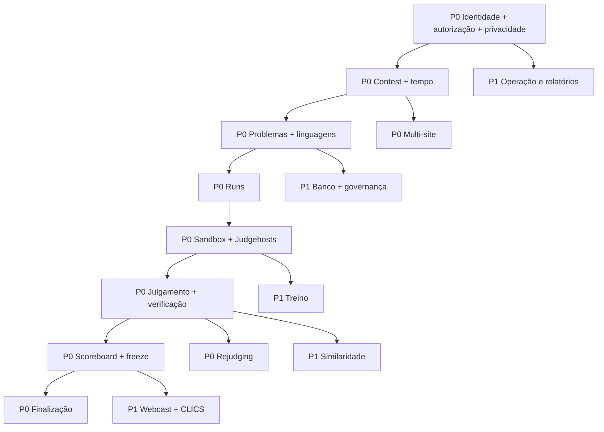

---

# 5. Rastreabilidade de Requisitos

A rastreabilidade liga capacidade, caso de uso, entidades, componentes e famílias de teste. O objetivo é permitir que uma mudança em regra de negócio seja localizada em todas as camadas afetadas.

| Capacidade | Casos de uso | Entidades | Componentes principais | Cobertura esperada |
| --- | --- | --- | --- | --- |
| F01 | UC-01, UC-02, UC-18, UC-19 | Contest, ContestEvent | ContestLifecycle, ContestFinalizer, ContestAwards | Feature/Unit: contest lifecycle, current state, finalization |
| F02 | UC-03, UC-04 | User, AccountActivation, PersonalAccessToken | Auth/Sanctum, activation | Feature: auth, tokens, activation |
| F03 | todos | User, Contest, Run | Middleware, Policies, ProfilePrivacyPolicy | Authorization matrix / privacy regression |
| F04 | UC-05, UC-24 | Site, SiteJudgingRoute | SiteController, ContestClock | Feature: site isolation, IP/CIDR, routes |
| F05 | UC-06, UC-07 | Problem, TestCase | ProblemController | Feature: statements, hidden tests, pause |
| F06 | UC-08 | ProblemBank, OwnershipTransfer | BocaImporter, bank governance | Feature: import/export/ownership |
| F07 | UC-06, UC-09 | Language, ProblemLanguageLimit | AutoJudgeService | Unit/Feature: effective limits |
| F08 | UC-09 | Run | Submit/Run controllers | Feature: submission ownership/immutability |
| F09 | UC-10, UC-24 | Run, Judgehost, Capability | AutoJudgeService, memory limiter, watchdog | Unit/Feature: claim, lease, isolation, health |
| F10 | UC-11 | Run, Answer | JudgeController | Feature: verify/unverify/visibility |
| F11 | UC-12 | Rejudging, RejudgingRun, Run | Rejudging service/controllers | Feature: dry-run/apply/cancel |
| F12 | UC-13, UC-18 | Score, Leaderboard, Run, Contest | Score recomputer, scoreboard controllers | Feature: scoring/freeze/unfreeze |
| F13 | UC-14 | Clarification | Clarification controllers | Feature: own/broadcast/pending |
| F14 | UC-15, UC-16 | SosCall, Task | SOS/Staff/Balloon services | Feature: queues/transitions/files |
| F15 | UC-17, UC-25 | ContestLog, ContestEvent | Logging/event feed | Feature: audit/event ordering |
| F16 | UC-18 | Contest/Run/Score | ContestReportBuilder | Feature: report scope/export |
| F17 | UC-19 | Contest, Score | ContestFinalizer, ContestAwards | Feature: blockers/finalization/awards |
| F18 | UC-20 | ContestTimeAdjustment | ContestClock | Unit/Feature: global/site extension |
| F19 | UC-21 | Contest, PracticePublication, Run | Practice controllers | Feature: publication/history/privacy |
| F20 | UC-08 | Organization, Membership, ProblemBank | Policies/governance controllers | Feature: membership/escalation |
| F21 | UC-22 | SimilarityCheck, SimilarityPair | Similarity jobs/services | Feature: job scope/results |
| F22 | UC-23 | WebcastCredential | Webcast/BOCA exporter | Feature: credential/freeze/export |
| F23 | UC-04, UC-24 | várias | routes/api.php, OpenAPI | Route authorization / contract tests |
| F24 | UC-25 | ContestEvent + domínio | Clics controllers/services | Feature: Contest API + freeze |
| F25 | UC-26 | Backup, Judgehost, Run | Backup services, watchdog | Feature: backup/reconcile/health |

### 5.1 Rastreabilidade entre estados críticos

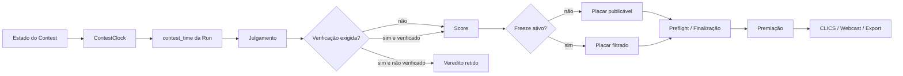

---

# 6. Diagrama de Classes do Projeto

Os diagramas de classes são divididos por agregado para permanecerem legíveis no GitHub. Eles representam relações conceituais e atributos essenciais; o esquema físico completo está no Apêndice C.

## 6.1 Núcleo de competição

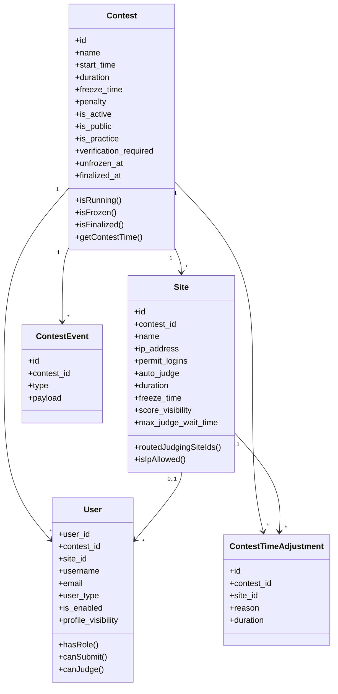

## 6.2 Problemas e execução

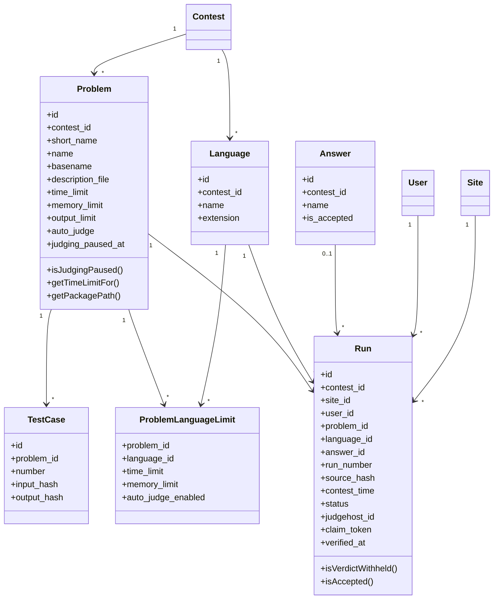

## 6.3 Julgamento distribuído e rejulgamento

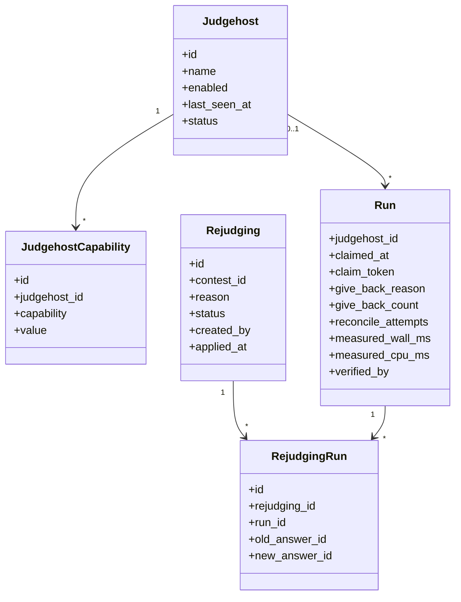

## 6.4 Operação e comunicação

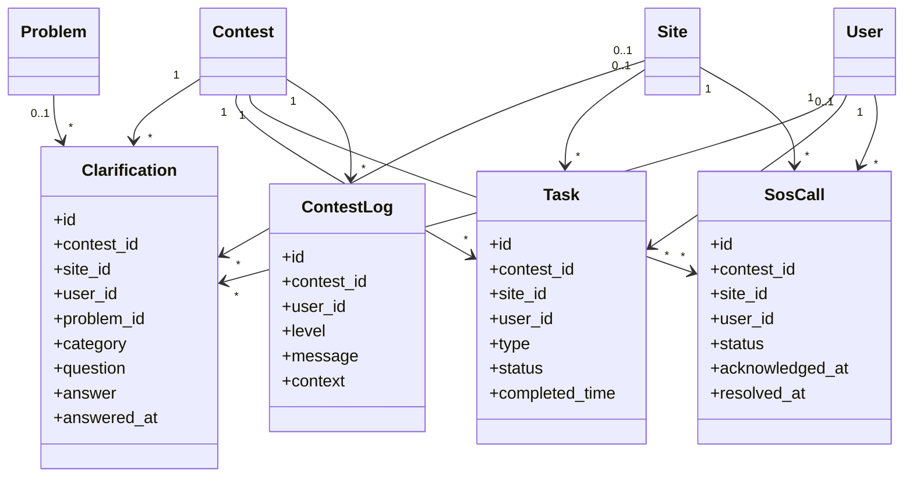

## 6.5 Governança e módulos complementares

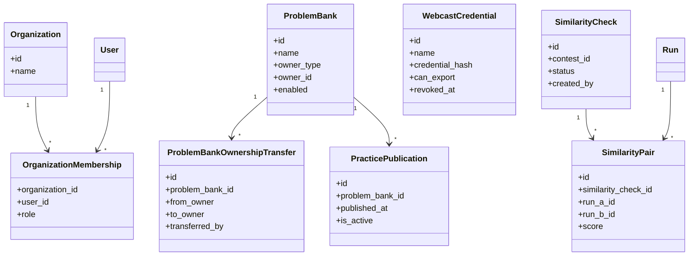

---

# 7. Modelagem de Desenvolvimento de Software Selecionada

O desenvolvimento do Helium é adequado a um modelo **iterativo e incremental**, dirigido por issues, testes automatizados, contratos versionados e revisão por pull request. Funcionalidades de competição possuem risco operacional alto; por isso, evolução deve combinar entrega incremental com controles formais de compatibilidade.

## 7.1 Princípios do processo

1. **Issue antes da mudança:** objetivo e risco devem ser explicitados.
2. **Contrato antes da UI quando necessário:** endpoint, autorização, estados e erros devem ser definidos antes de a interface anunciar uma capacidade.
3. **Migração antes do uso de dados:** mudanças persistentes entram por migration.
4. **Teste de regressão junto da correção:** bugs de autorização, scoring, tempo e julgamento exigem reprodução automatizada.
5. **Segurança por desenho:** sandbox, privacidade e role gates não são pós-processamento.
6. **Pull request revisável:** alterações grandes devem ser separadas por responsabilidade quando isso reduzir risco.
7. **Documentação viva:** contratos e SRS acompanham o produto.

## 7.2 Fluxo de desenvolvimento

```mermaid
flowchart LR
    Need[Problema / requisito] --> Issue[Issue + escopo]
    Issue --> Design[Regra / contrato / diagrama]
    Design --> Tests[Critérios + testes]
    Tests --> Code[Implementação]
    Code --> Static[Lint / análise estática]
    Static --> Suite[Testes unitários / feature / frontend]
    Suite --> Review[PR + revisão]
    Review --> Docs[Documentação / migration notes]
    Docs --> Release[Release]
    Release --> Smoke[Smoke / observação]
    Smoke --> Feedback[Feedback / nova issue]
    Feedback --> Issue
```

## 7.3 Estratégia de branches e integração

- branch curta por issue/tema;
- commits pequenos e explicativos;
- migrations aditivas antes de remoções incompatíveis;
- testes de contrato para rotas e autorização;
- merge somente com checks relevantes verdes;
- rollback ou correção de release documentada para mudanças operacionais.

## 7.4 Arquitetura de implantação

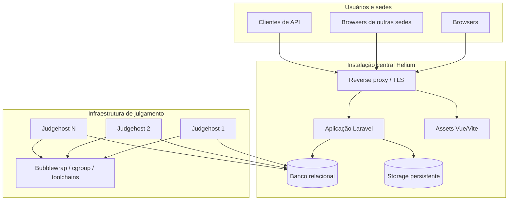

---

# 8. Cronograma Geral do Projeto

Este SRS não fixa datas comerciais. O cronograma abaixo expressa **dependências e ondas de entrega** que podem ser usadas em roadmap, milestone ou plano de release.

| Onda | Escopo | Dependências | Saída verificável |
| --- | --- | --- | --- |
| D0 | Infraestrutura de desenvolvimento, CI, banco e storage | — | build/testes reproduzíveis |
| D1 | Identidade, sessão, tokens, RBAC e privacidade | D0 | matriz de autorização verde |
| D2 | Contest, relógio, sedes e multi-site | D1 | lifecycle e clocks testados |
| D3 | Problemas, linguagens, casos de teste e pacotes | D2 | problema publicável + material secreto protegido |
| D4 | Runs e auto-judge isolado | D3 | submissão julgada ponta a ponta |
| D5 | Judge, verificação, rejudging e watchdog | D4 | fila operável e recuperável |
| D6 | Scoreboard, freeze, clarificações e tarefas | D5 | simulação de prova funcional |
| D7 | Finalização, premiação, relatórios e eventos | D6 | fechamento reproduzível |
| D8 | Banco, organizações, treino e similaridade | D3-D7 | recursos de governança completos |
| D9 | Webcast, OpenAPI e CLICS | D6-D7 | integração pública sem vazamento de freeze |
| D10 | Hardening, performance, restauração e ensaio geral | todas | go/no-go operacional documentado |

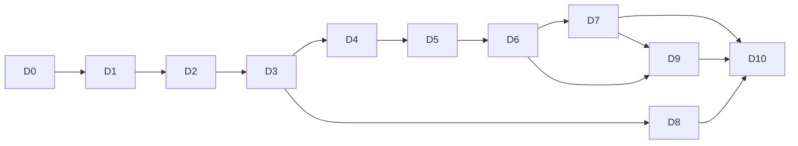

---

# 9. Custo Geral e Parcial do Desenvolvimento do Projeto

O custo do Helium varia por equipe, infraestrutura e escala do evento. Este documento evita atribuir valores monetários arbitrários e define um **modelo de composição de custo** que pode ser preenchido por cada organização.

## 9.1 Categorias de custo

| Categoria | Unidade recomendada | Componentes |
| --- | --- | --- |
| Engenharia backend | pessoa-hora | domínio, API, segurança, banco, jobs |
| Engenharia frontend | pessoa-hora | UI, acessibilidade, estados, integração |
| QA / testes | pessoa-hora | unit, feature, browser, carga, regressão |
| DevOps/SRE | pessoa-hora + infraestrutura | deploy, banco, storage, observabilidade, backup |
| Judgehosts | máquina-hora / evento | CPU, RAM, disco, toolchains, isolamento |
| Banco de dados | instância-hora + storage | persistência e backups |
| Storage | GB-mês | fontes, pacotes, relatórios, backups |
| Rede | tráfego + redundância | sedes, judgehosts, público |
| Segurança | pessoa-hora | revisão, hardening, resposta a incidentes |
| Operação do evento | pessoa-hora | admin, banca, staff, coordenação de sede |
| Documentação e treinamento | pessoa-hora | manuais, ensaio, runbook |

## 9.2 Fórmula de planejamento

```text
Custo total =
  Σ(pessoa-hora × custo-hora por perfil)
  + infraestrutura de aplicação
  + infraestrutura de julgamento
  + banco + storage + rede
  + serviços de terceiros, se houver
  + contingência operacional
```

A estimativa de custo deve ser associada ao número de participantes, submissões esperadas, linguagens, quantidade de sedes, número de judgehosts, duração do evento e política de retenção de artefatos.

---

# Apêndice A — Especificação detalhada de casos de uso

## UC-01 — Criar e configurar competição

**Ator principal:** Administrador  
**Pré-condições:** Usuário autenticado como admin; instalação funcional.  
**Pós-condições:** Contest persistido em estado configurável, ainda não necessariamente iniciado.  
**Rastreabilidade:** RF-F01-001..008; RN-001..012

**Fluxo principal**

1. Acessar gestão de competições.
2. Informar nome, descrição, início, duração, freeze, penalidade, visibilidade e limites.
3. Validar parâmetros e conflitos.
4. Persistir o contest.
5. Configurar sedes, linguagens, problemas e políticas relacionadas.
6. Revisar configuração antes da ativação.

**Fluxos alternativos e exceções**

- Dados inválidos: destacar campos e não persistir estado parcial.
- Configuração sem freeze: aceitar `freeze_time = 0`.
- Contest de prática: marcar explicitamente `is_practice`.

## UC-02 — Operar ciclo de vida da competição

**Ator principal:** Administrador  
**Pré-condições:** Contest existente; autoridade administrativa.  
**Pós-condições:** Estado do contest e do placar atualizado de forma auditável.  
**Rastreabilidade:** RF-F01; RF-F12; RN-003..010

**Fluxo principal**

1. Consultar estado e horário do servidor.
2. Ativar contest quando preparado.
3. Acompanhar início e execução pelo relógio canônico.
4. Opcionalmente encerrar antecipadamente.
5. Preservar freeze após o fim quando aplicável.
6. Executar unfreeze na cerimônia/publicação.

**Fluxos alternativos e exceções**

- Contest ainda não começou: ativação não antecipa o relógio.
- Freeze zero: não entrar em estado congelado.
- Falha de autorização: operação retorna 403 sem alteração.

## UC-03 — Autenticar-se pela interface web

**Ator principal:** Usuário  
**Pré-condições:** Conta existente e habilitada.  
**Pós-condições:** Sessão autenticada e regenerada ou tentativa rejeitada.  
**Rastreabilidade:** RF-F02; RF-F04-003; RN-015..023

**Fluxo principal**

1. Abrir login.
2. Informar e-mail/credencial e senha.
3. Servidor aplica throttle e valida credenciais.
4. Se houver sede com restrição de rede, validar IP/CIDR.
5. Regenerar sessão.
6. Redirecionar para destino permitido.

**Fluxos alternativos e exceções**

- Credencial inválida: rejeitar sem revelar qual campo existe.
- IP fora da rede: invalidar qualquer sessão recém-criada e registrar evento seguro.
- Conta desabilitada: negar acesso.

## UC-04 — Emitir, usar e revogar token de API

**Ator principal:** Usuário / Cliente de API  
**Pré-condições:** Conta habilitada; endpoint de token disponível.  
**Pós-condições:** Token emitido e posteriormente revogável pelo titular.  
**Rastreabilidade:** RF-F02-004..005; RF-F23; RN-021..022

**Fluxo principal**

1. Enviar credenciais ao endpoint de tokens.
2. Validar throttle e credenciais.
3. Emitir token Sanctum.
4. Usar Bearer token em rota protegida.
5. Listar tokens próprios.
6. Revogar token específico ou o corrente.

**Fluxos alternativos e exceções**

- Token inválido/revogado: 401.
- Tentativa de revogar token alheio: 403/404 conforme contrato.

## UC-05 — Configurar sede e roteamento de julgamento

**Ator principal:** Administrador  
**Pré-condições:** Contest existente.  
**Pós-condições:** Sede e rotas de julgamento configuradas no escopo correto.  
**Rastreabilidade:** RF-F04; RN-013..017

**Fluxo principal**

1. Criar sede vinculada ao contest.
2. Configurar login, rede, duração/freeze opcionais e parâmetros operacionais.
3. Configurar roteamento de source site para host site quando necessário.
4. Validar que todas as sedes pertencem ao mesmo contexto permitido.
5. Salvar e testar acesso/escopo.

**Fluxos alternativos e exceções**

- Sem override local: herdar contest.
- Sem rota explícita: judge da sede opera a própria sede.
- CIDR inválido: rejeitar configuração.

## UC-06 — Criar ou editar problema

**Ator principal:** Administrador / Judge  
**Pré-condições:** Contest existente; papel autorizado.  
**Pós-condições:** Problema válido, ordenado e pronto para publicação/julgamento conforme estado.  
**Rastreabilidade:** RF-F05; RF-F07; RN-025..029

**Fluxo principal**

1. Abrir gestão de problemas.
2. Informar short name, nome, metadados, statement, limites e flags.
3. Adicionar/validar casos de teste.
4. Configurar limites por linguagem quando necessário.
5. Persistir problema e testar leitura do statement.

**Fluxos alternativos e exceções**

- Arquivo de statement ausente: não oferecer link morto.
- Caminho malicioso: normalizar/rejeitar.
- Material oculto: nunca retornar em superfície de team.

## UC-07 — Pausar e retomar julgamento de problema

**Ator principal:** Judge / Administrador  
**Pré-condições:** Problema existente e autorizado.  
**Pós-condições:** Fila do problema aguarda ou retoma processamento sem perder runs.  
**Rastreabilidade:** RF-F05-005; RN-029

**Fluxo principal**

1. Identificar defeito potencial no problema.
2. Acionar pausa.
3. Registrar ator e instante.
4. Continuar aceitando submissões conforme política.
5. Corrigir/validar problema.
6. Retomar julgamento.
7. Processar runs elegíveis.

**Fluxos alternativos e exceções**

- Tentativa por team: 403.
- Problema de outro contest: negar.

## UC-08 — Importar e governar problema no banco

**Ator principal:** Administrador / Editor autorizado  
**Pré-condições:** Usuário autorizado; pacote disponível.  
**Pós-condições:** Item do banco válido, com ownership e trilha de governança.  
**Rastreabilidade:** RF-F06; RF-F20; RN-027, RN-051..052

**Fluxo principal**

1. Selecionar upload/importação.
2. Validar pacote e caminhos.
3. Extrair metadados, statement, testes e scripts permitidos.
4. Criar/atualizar item do banco.
5. Associar owner usuário/organização.
6. Opcionalmente transferir ownership com autorização.

**Fluxos alternativos e exceções**

- Pacote inválido: abortar sem estado parcial.
- Editor sem ownership: 403.
- Transferência inválida: manter owner atual.

## UC-09 — Submeter solução

**Ator principal:** Equipe  
**Pré-condições:** Usuário autenticado; contest/problema acessíveis; janela de submissão válida.  
**Pós-condições:** Run registrada e disponibilizada para julgamento.  
**Rastreabilidade:** RF-F08; RN-028..032

**Fluxo principal**

1. Abrir problema.
2. Escolher linguagem autorizada e arquivo/código.
3. Servidor valida contest, problema, linguagem, tamanho e usuário.
4. Calcular contest time no servidor.
5. Persistir fonte privada e hash.
6. Criar run e número operacional.
7. Retornar confirmação/estado.

**Fluxos alternativos e exceções**

- Duplicata: aplicar política de duplicidade.
- Problema pausado: registrar run e manter aguardando.
- Janela fechada ou problema não autorizado: rejeitar sem criar run.

## UC-10 — Julgar automaticamente uma run

**Ator principal:** Judgehost  
**Pré-condições:** Run pendente; judgehost habilitado e compatível; sandbox operacional.  
**Pós-condições:** Run julgada com resultado e métricas, ou devolvida/reconciliada com motivo.  
**Rastreabilidade:** RF-F09; RN-033..038

**Fluxo principal**

1. Worker busca trabalho elegível.
2. Claim atômico grava host, instante e token.
3. Preparar diretório efêmero isolado.
4. Compilar com toolchain configurada.
5. Executar casos de teste sob limites.
6. Comparar saída.
7. Registrar veredito, stdout/stderr permitido e métricas.
8. Confirmar resultado usando claim token vigente.
9. Liberar recursos temporários.

**Fluxos alternativos e exceções**

- Compilation Error: finalizar com resposta correspondente.
- TLE/MLE/RE: interromper conforme limite e classificar.
- Sandbox indisponível: não executar inseguramente.
- Lease perdida: resultado obsoleto é descartado.

## UC-11 — Julgar e verificar manualmente

**Ator principal:** Judge / Administrador  
**Pré-condições:** Run acessível à banca.  
**Pós-condições:** Veredito registrado; publicação obedece verification gate.  
**Rastreabilidade:** RF-F10; RN-039..041

**Fluxo principal**

1. Abrir fila de runs.
2. Inspecionar contexto e diagnósticos autorizados.
3. Atribuir/confirmar veredito.
4. Se verificação for exigida, manter resultado retido.
5. Verifier revisa e confirma.
6. Registrar `verified_at`, `verified_by` e comentário quando houver.
7. Recomputar score/visibilidade.

**Fluxos alternativos e exceções**

- Unverify autorizado: retirar liberação e recomputar.
- Judge não autorizado à sede: negar.

## UC-12 — Executar rejulgamento em lote

**Ator principal:** Judge / Administrador  
**Pré-condições:** Contest e runs existentes; papel autorizado.  
**Pós-condições:** Conjunto rejulgado com histórico de antes/depois e score consistente.  
**Rastreabilidade:** RF-F11; RN-042..043

**Fluxo principal**

1. Selecionar filtros e informar motivo.
2. Executar dry-run.
3. Revisar runs afetadas e política sobre accepted.
4. Criar rejudging.
5. Aplicar.
6. Enfileirar/processar runs.
7. Persistir resultados relacionados.
8. Recalcular score.

**Fluxos alternativos e exceções**

- Cancelar antes da aplicação quando estado permitir.
- Filtro vazio: informar sem criar efeito.
- Conflito de estado: 409/erro equivalente.

## UC-13 — Consultar scoreboard

**Ator principal:** Equipe / Público / Staff  
**Pré-condições:** Contest visível à audiência.  
**Pós-condições:** Classificação retornada com filtro correto de freeze e verificação.  
**Rastreabilidade:** RF-F12; RN-005..009, RN-039..041

**Fluxo principal**

1. Solicitar scoreboard.
2. Resolver audiência e papel.
3. Calcular scores válidos.
4. Remover vereditos retidos para audiência não privilegiada.
5. Aplicar freeze quando ativo.
6. Ordenar por regras de classificação.
7. Retornar placar.

**Fluxos alternativos e exceções**

- Contest privado: visitante não recebe dados.
- Após unfreeze: liberar eventos anteriormente ocultos, respeitando outras políticas.

## UC-14 — Enviar e responder clarificação

**Ator principal:** Equipe / Judge  
**Pré-condições:** Contest acessível; team autenticado para perguntar; judge autorizado para responder.  
**Pós-condições:** Pergunta e resposta registradas com visibilidade correta.  
**Rastreabilidade:** RF-F13; RN-044..045

**Fluxo principal**

1. Equipe cria pergunta e opcionalmente associa problema/categoria.
2. Sistema registra tempo do contest.
3. Banca consulta pendentes.
4. Banca responde.
5. Banca decide resposta privada ou broadcast quando suportado.
6. Sistema publica somente à audiência autorizada.

**Fluxos alternativos e exceções**

- Outra equipe acessa ID privado: negar.
- Problema fora do contest: rejeitar associação.

## UC-15 — Solicitar e atender S.O.S.

**Ator principal:** Equipe / Staff / Site  
**Pré-condições:** Equipe autenticada e associada a sede.  
**Pós-condições:** Chamado resolvido com estados e tempos registrados.  
**Rastreabilidade:** RF-F14-001..002; RN-046

**Fluxo principal**

1. Equipe abre chamado.
2. Sistema impede duplicata ativa quando regra estiver habilitada.
3. Fila local exibe chamado.
4. Staff/site reconhece.
5. Atendimento ocorre.
6. Staff/site resolve com registro de tempo/ator.

**Fluxos alternativos e exceções**

- Hammering: throttle protege endpoint.
- Ator de outra sede: negar.

## UC-16 — Executar tarefa operacional

**Ator principal:** Staff / Site  
**Pré-condições:** Tarefa existente e autorizada.  
**Pós-condições:** Tarefa concluída e auditável.  
**Rastreabilidade:** RF-F14-003..006; RN-047..048

**Fluxo principal**

1. Abrir fila da sede.
2. Selecionar tarefa.
3. Baixar arquivo autorizado se necessário.
4. Executar ação física/operacional.
5. Marcar conclusão.
6. Registrar responsável e tempo.

**Fluxos alternativos e exceções**

- Arquivo ausente: mostrar erro sem marcar concluído.
- Staff fora do escopo: negar.

## UC-17 — Auditar incidente

**Ator principal:** Admin / Judge / Staff autorizado  
**Pré-condições:** Existe evento, run ou ação sob análise.  
**Pós-condições:** Linha do tempo técnica reconstruída sem vazamento indevido.  
**Rastreabilidade:** RF-F15; RN-049

**Fluxo principal**

1. Definir contest e janela temporal.
2. Consultar logs/eventos autorizados.
3. Correlacionar run, judgehost, verifier, rejudging, ajuste ou usuário.
4. Verificar timestamps do servidor.
5. Exportar/registrar conclusão fora do sistema se processo exigir.

**Fluxos alternativos e exceções**

- Dados sensíveis: ocultar campos não necessários.
- Escopo de staff/site: filtrar registros globais.

## UC-18 — Gerar relatório ou exportação

**Ator principal:** Admin / Judge / Staff/Site conforme tipo  
**Pré-condições:** Dados existentes; papel com acesso.  
**Pós-condições:** Artefato consistente com estado e política de publicação.  
**Rastreabilidade:** RF-F16; RN-050

**Fluxo principal**

1. Escolher tipo de relatório.
2. Aplicar filtros autorizados.
3. Calcular dados.
4. Aplicar freeze/privacidade quando audiência exigir.
5. Gerar resposta/arquivo.
6. Registrar operação quando relevante.

**Fluxos alternativos e exceções**

- Dataset vazio: gerar estado vazio válido, não erro enganoso.
- Export sensível por papel inadequado: 403.

## UC-19 — Finalizar competição e derivar premiação

**Ator principal:** Admin / Judge autorizado  
**Pré-condições:** Contest terminou ou foi encerrado; banca preparada para fechamento.  
**Pós-condições:** Contest finalizado e awards calculados, sem publicação indevida.  
**Rastreabilidade:** RF-F17; RN-008..009

**Fluxo principal**

1. Solicitar preflight.
2. Sistema verifica runs pendentes, verificações, rejudgings e demais blockers.
3. Resolver pendências.
4. Executar finalização.
5. Registrar ator/data.
6. Calcular awards.
7. Revisar premiação.
8. Executar unfreeze/publicação quando apropriado.

**Fluxos alternativos e exceções**

- Blocker presente: impedir finalização e listar causa.
- Freeze ainda ativo: finalização não implica unfreeze.

## UC-20 — Registrar ajuste de tempo

**Ator principal:** Judge / Admin  
**Pré-condições:** Contest existente; motivo operacional.  
**Pós-condições:** Relógio efetivo alterado no escopo correto.  
**Rastreabilidade:** RF-F18; RN-010..012

**Fluxo principal**

1. Escolher contest e, se local, sede.
2. Informar intervalo/duração e motivo.
3. Validar parâmetros.
4. Persistir ajuste.
5. Recalcular end time/clock efetivo.
6. Propagar novo estado para UI/API.

**Fluxos alternativos e exceções**

- Sede de outro contest: rejeitar.
- Remoção posterior: recalcular usando ajustes restantes.

## UC-21 — Resolver problema em treino livre

**Ator principal:** Usuário elegível  
**Pré-condições:** Problema publicado para prática; infraestrutura de julgamento disponível.  
**Pós-condições:** Run de prática julgada e histórico privado atualizado.  
**Rastreabilidade:** RF-F19; RN-053..054

**Fluxo principal**

1. Acessar catálogo de prática.
2. Abrir problema publicado.
3. Submeter solução.
4. Executar pipeline seguro de julgamento.
5. Mostrar resultado permitido.
6. Registrar histórico do usuário.

**Fluxos alternativos e exceções**

- Problema retirado: não aceitar nova run.
- Privacidade bloqueada: não publicar estatística pessoal externamente.

## UC-22 — Executar análise de similaridade

**Ator principal:** Admin / Judge autorizado  
**Pré-condições:** Contest com fontes elegíveis; ferramenta configurada.  
**Pós-condições:** Check concluído com pares restritos à banca.  
**Rastreabilidade:** RF-F21; RN-055

**Fluxo principal**

1. Criar check com escopo.
2. Validar autorização.
3. Enfileirar job.
4. Preparar conjunto de fontes autorizado.
5. Executar mecanismo de similaridade.
6. Persistir pares/scores.
7. Exibir resultados à banca.

**Fluxos alternativos e exceções**

- Ferramenta indisponível: estado explícito de falha/indisponibilidade.
- Team tenta acessar: 403.

## UC-23 — Gerenciar webcast

**Ator principal:** Administrador  
**Pré-condições:** Contest configurado; usuário admin.  
**Pós-condições:** Credencial emitida/revogada e publicação respeita políticas.  
**Rastreabilidade:** RF-F22; RN-056

**Fluxo principal**

1. Abrir gestão de webcast.
2. Emitir credencial com capacidades mínimas.
3. Consumidor autentica quando contrato exigir.
4. Servidor gera dados filtrados por freeze/verificação.
5. Opcionalmente exportar artefato se `can_export`.
6. Revogar credencial ao fim.

**Fluxos alternativos e exceções**

- Credencial revogada: negar.
- Export não homologado/desabilitado: retornar indisponibilidade, não fixture.

## UC-24 — Consumir API própria

**Ator principal:** Cliente de API  
**Pré-condições:** Token válido para rotas protegidas.  
**Pós-condições:** Operação executada dentro do papel e escopo do titular.  
**Rastreabilidade:** RF-F23; RN-001, RN-021

**Fluxo principal**

1. Autenticar via Bearer token.
2. Consultar recurso permitido.
3. Servidor autentica, autoriza objeto e aplica visibilidade.
4. Executar leitura/mutação.
5. Retornar JSON/status documentado.

**Fluxos alternativos e exceções**

- Sem token: 401.
- Papel insuficiente: 403.
- Validação: 422.
- Throttle: 429.

## UC-25 — Consumir CLICS e event-feed

**Ator principal:** Integrador / Público / Staff autenticado  
**Pré-condições:** Contest publicável; endpoint CLICS disponível.  
**Pós-condições:** Recursos interoperáveis retornados com visão adequada à audiência.  
**Rastreabilidade:** RF-F24; RN-056..057

**Fluxo principal**

1. Descobrir access/contests.
2. Consultar state/problems/teams/languages.
3. Consultar submissions/judgements/scoreboard.
4. Servidor aplica freeze/verification gate.
5. Consultar event-feed em ordem estável.
6. Após finalização/publicação, consultar awards.

**Fluxos alternativos e exceções**

- Staff autenticado: pode receber visão privilegiada conforme autorização.
- Visitante: recebe somente visão pública.

## UC-26 — Executar backup e validar restauração

**Ator principal:** Administrador / Operador  
**Pré-condições:** Acesso operacional autorizado; destino de backup disponível.  
**Pós-condições:** Cópia verificável e procedimento de restauração testado.  
**Rastreabilidade:** RF-F25; RN-059..060

**Fluxo principal**

1. Iniciar backup.
2. Capturar banco e artefatos exigidos.
3. Gerar manifesto/metadados.
4. Validar integridade do arquivo/conjunto.
5. Restaurar em ambiente seguro de teste.
6. Executar smoke checks críticos.
7. Registrar resultado.

**Fluxos alternativos e exceções**

- Storage insuficiente: falhar com diagnóstico.
- Restauração parcial: não declarar sucesso.

---

# Apêndice B — Catálogo UML complementar

Este catálogo usa Mermaid para que os diagramas sejam versionáveis, revisáveis em pull requests e renderizados diretamente no GitHub. Diagramas de caso de uso, componentes, pacotes e implantação são representados com `flowchart`, preservando a semântica UML de atores, limites e dependências.

## B.1 Casos de uso por ator

### B.1.1 Participante

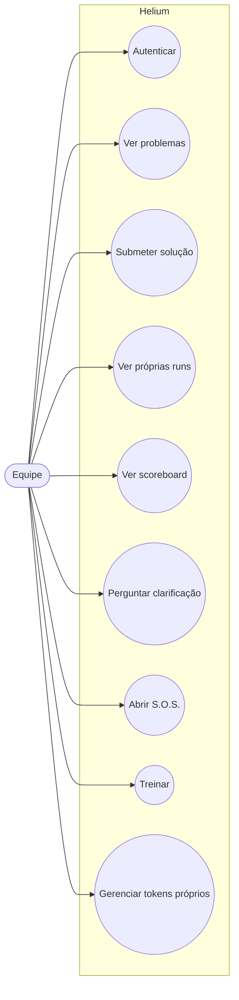

### B.1.2 Administrador

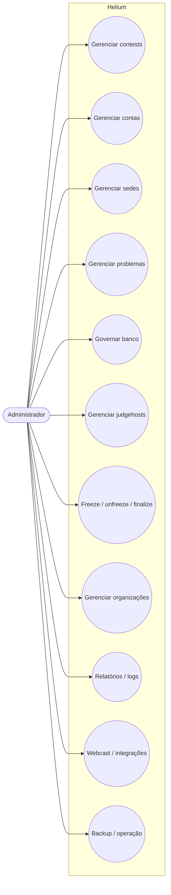

### B.1.3 Judge, Staff e Site

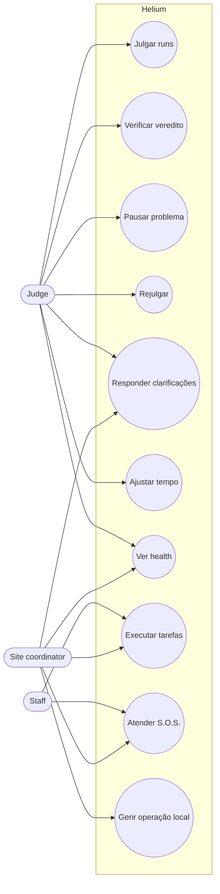

## B.2 Diagrama de pacotes

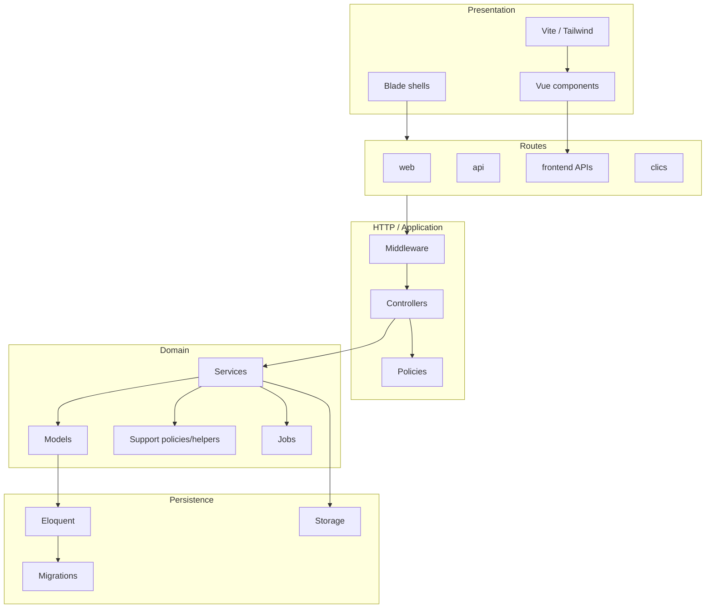

## B.3 Diagrama de componentes

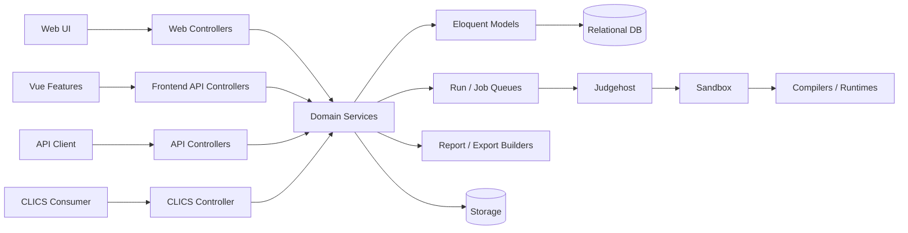

## B.4 Diagrama de implantação multi-site

```mermaid
flowchart TB
    subgraph SiteA[Sede A]
      ATeams[Equipes A]
      AStaff[Staff A]
    end
    subgraph SiteB[Sede B]
      BTeams[Equipes B]
      BStaff[Staff B]
    end
    Internet[Link de rede redundante recomendado]
    subgraph Central[Datacenter / servidor central]
      Proxy[HTTPS Reverse Proxy]
      App[Helium App]
      DB[(SQL Database)]
      FS[(Persistent Storage)]
    end
    subgraph JudgeFarm[Judge farm]
      J1[Judgehost A]
      J2[Judgehost B]
      J3[Judgehost N]
    end
    ATeams --> Internet
    AStaff --> Internet
    BTeams --> Internet
    BStaff --> Internet
    Internet --> Proxy --> App
    App --> DB
    App --> FS
    J1 --> DB
    J2 --> DB
    J3 --> DB
    J1 --> FS
    J2 --> FS
    J3 --> FS
```

## B.5 Máquinas de estado

### B.5.1 Contest

```mermaid
stateDiagram-v2
    [*] --> Draft
    Draft --> Scheduled: configuração válida
    Scheduled --> Running: ativo e start_time alcançado
    Running --> Frozen: freeze_time alcançado
    Running --> Ended: fim sem freeze
    Running --> EndedFrozen: encerramento com freeze
    Frozen --> EndedFrozen: fim / encerramento
    Ended --> Finalizable
    EndedFrozen --> Finalizable
    Finalizable --> Finalized: preflight ok + finalize
    EndedFrozen --> Revealed: unfreeze
    Finalized --> Revealed: unfreeze/publicação
    Revealed --> Published
    Published --> [*]
    Running --> Running: ajuste de tempo
    Frozen --> Frozen: ajuste de tempo
```

### B.5.2 Run

```mermaid
stateDiagram-v2
    [*] --> Pending: submissão criada
    Pending --> Judging: claim válido
    Judging --> Pending: give-back / lease recuperada
    Judging --> Judged: resultado produzido
    Judged --> Withheld: verificação exigida
    Withheld --> Verified: verify
    Verified --> Withheld: unverify
    Judged --> Rejudging: rejudge
    Verified --> Rejudging: rejudge
    Withheld --> Rejudging: rejudge
    Rejudging --> Pending: reenfileirar
    Judged --> [*]: sem gate
    Verified --> [*]: resultado liberado
```

### B.5.3 Clarificação

```mermaid
stateDiagram-v2
    [*] --> Pending: pergunta criada
    Pending --> AnsweredPrivate: resposta direcionada
    Pending --> Broadcast: resposta publicada
    AnsweredPrivate --> Broadcast: promover resposta
    AnsweredPrivate --> [*]
    Broadcast --> [*]
```

### B.5.4 Rejudging

```mermaid
stateDiagram-v2
    [*] --> Preview
    Preview --> Created: confirmar escopo e motivo
    Created --> Applying: aplicar
    Created --> Cancelled: cancelar
    Applying --> Completed: todas runs processadas
    Applying --> Failed: falha operacional
    Failed --> Applying: retomar quando seguro
    Cancelled --> [*]
    Completed --> [*]
```

### B.5.5 S.O.S.

```mermaid
stateDiagram-v2
    [*] --> Open: equipe solicita
    Open --> Acknowledged: staff/site assume
    Acknowledged --> Resolved: atendimento concluído
    Open --> Resolved: resolução direta autorizada
    Resolved --> [*]
```

### B.5.6 Judgehost

```mermaid
stateDiagram-v2
    [*] --> Registered
    Registered --> Online: heartbeat / atividade
    Online --> Busy: claim run
    Busy --> Online: entrega resultado
    Busy --> Degraded: falha / timeout repetido
    Online --> Offline: heartbeat expirado
    Degraded --> Offline: desabilitado / indisponível
    Offline --> Online: retorno validado
    Online --> Disabled: admin desabilita
    Disabled --> Online: admin habilita + health ok
```

## B.6 Diagramas de sequência

### B.6.1 Login web com restrição de rede

```mermaid
sequenceDiagram
    actor U as Usuário
    participant B as Browser
    participant W as Web App
    participant DB as DB
    participant N as NetworkMatcher
    U->>B: informa credenciais
    B->>W: POST /login
    W->>W: throttle + validate
    W->>DB: localizar usuário
    DB-->>W: usuário + site
    W->>W: verificar senha / enabled
    alt site possui IP/CIDR
      W->>N: isIpAllowed(request.ip)
      N-->>W: permitido?
    end
    alt permitido
      W->>W: regenerate session
      W-->>B: redirect /home
    else negado
      W->>W: logout + invalidate session
      W->>DB: audit warning sem segredo
      W-->>B: erro de acesso
    end
```

### B.6.2 Emissão e uso de token

```mermaid
sequenceDiagram
    actor C as Cliente
    participant API as Helium API
    participant Auth as Auth/Sanctum
    participant DB as DB
    C->>API: POST /api/tokens + credenciais
    API->>Auth: validar + throttle
    Auth->>DB: usuário habilitado
    DB-->>Auth: ok
    Auth-->>API: token
    API-->>C: token emitido
    C->>API: GET recurso + Bearer
    API->>Auth: autenticar token
    Auth-->>API: User
    API->>API: autorizar role + objeto
    API-->>C: JSON permitido
    C->>API: DELETE token
    API->>DB: revogar token próprio
    API-->>C: confirmação
```

### B.6.3 Submissão ponta a ponta

```mermaid
sequenceDiagram
    actor T as Team
    participant UI as Web/API
    participant Clock as ContestClock
    participant DB as DB
    participant FS as Storage
    participant JH as Judgehost
    T->>UI: enviar fonte + linguagem + problema
    UI->>UI: auth + escopo + validação
    UI->>Clock: contestTime(contest, site)
    Clock-->>UI: tempo canônico
    UI->>FS: armazenar fonte privada
    UI->>DB: criar Run pending + hash
    DB-->>UI: run_number / id
    UI-->>T: submissão recebida
    JH->>DB: claim atômico
    DB-->>JH: Run + claim_token
    JH->>JH: compilar/executar isolado
    JH->>DB: resultado + token vigente
    DB-->>JH: commit
    T->>UI: consultar submissão
    UI->>UI: aplicar verification gate
    UI-->>T: estado/veredito permitido
```

### B.6.4 Auto-judge interno

```mermaid
sequenceDiagram
    participant W as Worker
    participant DB as DB
    participant P as Problem Package
    participant S as Sandbox
    participant CG as Resource Limits
    W->>DB: localizar run elegível
    W->>DB: lock + claim token
    DB-->>W: run / problem / language
    W->>P: carregar scripts/testes autorizados
    W->>S: criar ambiente efêmero
    W->>CG: configurar CPU/memória/tempo
    W->>S: compilar
    alt compilação falha
      S-->>W: Compilation Error
    else compilação ok
      loop casos de teste
        W->>S: executar input
        S-->>W: stdout/stderr/medidas
        W->>W: comparar saída
      end
    end
    W->>DB: registrar resultado com claim token
    W->>S: destruir ambiente temporário
```

### B.6.5 Verification gate

```mermaid
sequenceDiagram
    participant AJ as AutoJudge/Judge
    participant DB as DB
    participant Score as Score Service
    participant Team as Team UI
    participant J as Verifier
    AJ->>DB: verdict judged
    DB->>DB: verification_required?
    alt não
      DB->>Score: resultado conta
      Team->>DB: consultar
      DB-->>Team: veredito
    else sim
      DB->>Score: excluir enquanto não verificado
      Team->>DB: consultar
      DB-->>Team: resultado retido
      J->>DB: verify(run)
      DB->>Score: recomputar
      Team->>DB: consultar
      DB-->>Team: veredito liberado
    end
```

### B.6.6 Rejudging em lote

```mermaid
sequenceDiagram
    actor J as Judge
    participant API as Rejudging Controller
    participant S as Rejudging Service
    participant DB as DB
    participant Q as Judge Queue
    participant Score as Score Recomputer
    J->>API: dry-run filtros + motivo
    API->>S: selecionar candidatos
    S->>DB: query autorizada
    DB-->>S: runs alvo
    S-->>API: preview
    API-->>J: contagem/lista/resumo
    J->>API: criar/aplicar
    API->>DB: criar Rejudging + RejudgingRuns
    API->>Q: reenfileirar runs
    Q-->>DB: novos resultados
    API->>Score: recomputar contest
    Score->>DB: atualizar score
    API-->>J: status final
```

### B.6.7 Clarificação

```mermaid
sequenceDiagram
    actor T as Team
    participant C as Clarification API
    participant DB as DB
    actor J as Judge
    T->>C: criar pergunta
    C->>C: validar contest/problem/actor
    C->>DB: persistir pending
    C-->>T: confirmação
    J->>C: listar pending
    C->>DB: buscar escopo da banca
    DB-->>J: fila
    J->>C: responder / broadcast
    C->>DB: answer + answered_at + actor
    T->>C: listar clarificações
    C->>C: filtrar own + broadcasts
    C-->>T: resposta autorizada
```

### B.6.8 Freeze, fim, finalização e revelação

```mermaid
sequenceDiagram
    participant Clock as ContestClock
    participant Contest as Contest
    participant Score as Scoreboard
    actor Admin as Admin
    participant Final as Finalizer
    Clock->>Contest: freeze moment alcançado
    Contest->>Score: ativar visão congelada
    Clock->>Contest: end_time alcançado
    Contest->>Contest: ended; freeze permanece
    Admin->>Final: preflight
    Final->>Contest: verificar pendências
    Final-->>Admin: blockers / ok
    Admin->>Final: finalize
    Final->>Contest: finalized_at + awards base
    Admin->>Contest: unfreeze
    Contest->>Score: liberar visão final
```

### B.6.9 Ajuste de tempo

```mermaid
sequenceDiagram
    actor J as Judge
    participant API as TimeAdjustment Controller
    participant DB as DB
    participant Clock as ContestClock
    participant UI as Clients
    J->>API: criar ajuste + motivo + escopo
    API->>API: validar contest/site
    API->>DB: persistir ajuste
    API->>Clock: recalcular duração efetiva
    Clock->>DB: ler ajustes aplicáveis
    Clock-->>API: novo end_time efetivo
    API-->>J: confirmação
    UI->>Clock: consultar estado atual
    Clock-->>UI: server_time + end_time efetivo
```

### B.6.10 Roteamento de julgamento multi-site

```mermaid
sequenceDiagram
    actor JudgeA as Judge na sede A
    participant SiteA as Site A
    participant Routes as SiteJudgingRoutes
    participant Runs as Runs Query
    participant DB as DB
    JudgeA->>SiteA: abrir fila de julgamento
    SiteA->>Routes: routedJudgingSiteIds()
    Routes->>DB: source sites roteadas para A
    DB-->>Routes: A + sites autorizadas
    Routes-->>Runs: ids permitidos
    Runs->>DB: filtrar contest + site_id IN ids
    DB-->>JudgeA: somente runs autorizadas
```

### B.6.11 Importação de pacote de problema

```mermaid
sequenceDiagram
    actor E as Editor/Admin
    participant I as Importer
    participant V as Validator
    participant FS as Storage
    participant DB as DB
    E->>I: enviar pacote
    I->>V: validar formato, paths e metadados
    alt inválido
      V-->>I: erros
      I-->>E: rejeição sem estado parcial
    else válido
      V-->>I: manifesto normalizado
      I->>FS: extrair em diretório permitido
      I->>DB: criar/atualizar problema + testes + limites
      I->>DB: aplicar ownership/policy
      I-->>E: importação concluída
    end
```

### B.6.12 CLICS público versus staff

```mermaid
sequenceDiagram
    actor C as CLICS Consumer
    participant R as /api/clics
    participant Auth as Optional Sanctum
    participant P as Publication Policy
    participant D as Domain
    C->>R: GET scoreboard/judgements/event-feed
    R->>Auth: existe staff autenticado?
    Auth-->>R: viewer ou anonymous
    R->>P: aplicar contest visibility + freeze + verification
    P->>D: obter dados permitidos
    D-->>P: domínio completo
    P-->>R: visão filtrada
    R-->>C: recurso CLICS
```

### B.6.13 Webcast

```mermaid
sequenceDiagram
    actor A as Admin
    participant W as Webcast Service
    participant DB as DB
    actor X as Consumer
    A->>W: emitir credencial
    W->>DB: armazenar hash/capabilities
    W-->>A: segredo exibido no momento permitido
    X->>W: solicitar dados/export
    W->>DB: validar credencial e revogação
    W->>W: aplicar freeze + privacy + verification
    alt can_export
      W-->>X: artefato permitido
    else somente leitura
      W-->>X: dados permitidos / negar export
    end
    A->>W: revogar
    W->>DB: revoked_at
```

### B.6.14 Similaridade

```mermaid
sequenceDiagram
    actor J as Judge/Admin
    participant API as Similarity API
    participant Job as Similarity Job
    participant DB as DB
    participant Tool as Similarity Engine
    J->>API: solicitar check
    API->>DB: criar SimilarityCheck queued
    API-->>J: 202 / id
    Job->>DB: buscar fontes autorizadas
    Job->>Tool: analisar conjunto
    Tool-->>Job: pares + scores
    Job->>DB: persistir pairs + completed
    J->>API: consultar check
    API->>DB: carregar resultados autorizados
    API-->>J: pares ordenáveis
```

## B.7 Diagramas de atividades

### B.7.1 Configuração e liberação de contest

```mermaid
flowchart TD
    A([Início]) --> B[Criar contest]
    B --> C[Configurar tempo / freeze / penalidade]
    C --> D[Configurar sedes e rede]
    D --> E[Configurar linguagens]
    E --> F[Adicionar problemas/testes]
    F --> G[Configurar usuários/papéis]
    G --> H[Validar judgehosts]
    H --> I[Executar smoke/ensaio]
    I --> J{Go?}
    J -- não --> K[Corrigir pendências]
    K --> I
    J -- sim --> L[Ativar contest]
    L --> M([Pronto para início])
```

### B.7.2 Recebimento de submissão

```mermaid
flowchart TD
    A([POST submissão]) --> B{Autenticado e pode submeter?}
    B -- não --> X[401/403]
    B -- sim --> C{Contest/problema visível e aberto?}
    C -- não --> Y[404/422 conforme contrato]
    C -- sim --> D{Linguagem e arquivo válidos?}
    D -- não --> Z[422]
    D -- sim --> E[Calcular contest_time]
    E --> F[Armazenar fonte privada + hash]
    F --> G{Duplicata segundo política?}
    G -- sim --> H[Aplicar regra de duplicidade]
    G -- não --> I[Criar Run pending]
    H --> I
    I --> J{Problema pausado?}
    J -- sim --> K[Manter aguardando]
    J -- não --> L[Disponibilizar para claim]
    K --> M([Retornar run])
    L --> M
```

### B.7.3 Worker de auto-judge

```mermaid
flowchart TD
    A([Worker disponível]) --> B[Buscar run elegível]
    B --> C{Encontrou?}
    C -- não --> W[Aguardar/backoff]
    W --> B
    C -- sim --> D[Claim atômico + token]
    D --> E{Sandbox disponível?}
    E -- não --> F[Give-back / falha operacional]
    E -- sim --> G[Preparar ambiente]
    G --> H[Compilar]
    H --> I{Compilou?}
    I -- não --> CE[Compilation Error]
    I -- sim --> J[Executar casos de teste]
    J --> K{Limite ou erro?}
    K -- TLE/MLE/RE --> V[Definir veredito]
    K -- não --> L{Saída correta?}
    L -- não --> WA[Wrong Answer]
    L -- sim --> N{Há mais casos?}
    N -- sim --> J
    N -- não --> AC[Accepted]
    CE --> O[Persistir resultado se claim vigente]
    V --> O
    WA --> O
    AC --> O
    O --> P[Limpar ambiente]
    P --> Q([Próxima run])
```

### B.7.4 Finalização

```mermaid
flowchart TD
    A([Solicitar preflight]) --> B[Checar runs pendentes]
    B --> C[Checar verification gate]
    C --> D[Checar rejudgings em aberto]
    D --> E[Checar consistência de score]
    E --> F{Há blockers?}
    F -- sim --> G[Listar blockers]
    G --> H([Não finalizar])
    F -- não --> I[Calcular classificação]
    I --> J[Derivar awards]
    J --> K[Persistir finalized_at/by]
    K --> L{Freeze ativo?}
    L -- sim --> M[Aguardar unfreeze explícito]
    L -- não --> N[Resultado publicável]
    M --> O([Finalizado])
    N --> O
```

### B.7.5 S.O.S. operacional

```mermaid
flowchart TD
    A([Equipe precisa de ajuda]) --> B{Já existe chamado ativo?}
    B -- sim --> C[Exibir chamado existente]
    B -- não --> D[Criar S.O.S. aberto]
    D --> E[Fila da sede]
    E --> F[Staff reconhece]
    F --> G[Atendimento físico]
    G --> H{Resolvido?}
    H -- não --> G
    H -- sim --> I[Marcar resolved + ator/tempo]
    I --> J([Fim])
```

### B.7.6 Backup e recuperação

```mermaid
flowchart TD
    A([Iniciar backup]) --> B[Congelar/consistir snapshot lógico quando necessário]
    B --> C[Exportar banco]
    C --> D[Copiar artefatos necessários]
    D --> E[Gerar manifesto]
    E --> F[Verificar integridade]
    F --> G{Íntegro?}
    G -- não --> H[Marcar falha]
    G -- sim --> I[Restaurar em ambiente de teste]
    I --> J[Rodar smoke checks]
    J --> K{Smoke ok?}
    K -- não --> H
    K -- sim --> L[Registrar backup recuperável]
```

### B.7.7 Publicação de problema

```mermaid
flowchart TD
    A([Problema recebido]) --> B[Validar pacote/metadados]
    B --> C{Válido?}
    C -- não --> X[Rejeitar]
    C -- sim --> D[Normalizar paths]
    D --> E[Persistir statement]
    E --> F[Persistir testes ocultos]
    F --> G[Aplicar limites/linguagens]
    G --> H[Definir ownership]
    H --> I[Executar validação técnica]
    I --> J{Aprovado?}
    J -- não --> K[Manter não publicado/corrigir]
    J -- sim --> L[Publicar no contest ou practice]
```

## B.8 Diagrama de dependências de segurança

```mermaid
flowchart LR
    Auth[Autenticação] --> Role[Role gate]
    Role --> Object[Autorização do objeto]
    Object --> Scope[Contest / site / ownership]
    Scope --> Visibility[Visibility / privacy]
    Visibility --> Freeze[Freeze / verification gate]
    Freeze --> Serialization[Serialização mínima]
    Serialization --> Audit[Auditoria sem segredos]
```


## B.9 Diagramas UML adicionais úteis

Os diagramas abaixo complementam as visões principais. Mermaid não possui notação nativa para todos os treze tipos de diagrama UML; quando necessário, a semântica UML é representada com `flowchart`, mantendo instâncias, conectores, mensagens numeradas e fronteiras internas de componentes.

### B.9.1 Diagrama de objetos — snapshot de uma submissão

```mermaid
flowchart LR
    C["contest:Contest\nid=42\nname=Final Nacional\nverification_required=true"]
    S["site:Site\nid=3\nname=Sede Betim"]
    U["team:User\nuser_id=501\nuser_type=team"]
    P["problem:Problem\nid=7\nshort_name=C"]
    L["language:Language\nid=2\nname=Cpp"]
    R["run:Run\nid=9912\nrun_number=184\nstatus=judged"]
    A["answer:Answer\nid=1\nname=Accepted"]
    JH["host:Judgehost\nid=5\nstatus=online"]
    C --> S
    C --> P
    C --> L
    S --> U
    U --> R
    P --> R
    L --> R
    R --> A
    JH --> R
```

Este snapshot mostra um exemplo de objetos concretos e seus vínculos em um instante do sistema. IDs e valores são ilustrativos; a finalidade é documentar a estrutura de instâncias, não dados de produção.

### B.9.2 Diagrama de comunicação — submissão e julgamento

```mermaid
flowchart LR
    Team["team:Browser"]
    API["submission:Controller"]
    Clock["clock:ContestClock"]
    DB["db:Database"]
    Host["worker:Judgehost"]
    Sandbox["sandbox:Executor"]
    Team -->|"1: submit(source, problem, language)"| API
    API -->|"1.1: authorize()"| API
    API -->|"1.2: contestTime()"| Clock
    API -->|"1.3: createRun(pending)"| DB
    Host -->|"2: claimNextRun()"| DB
    DB -->|"2.1: run + claim_token"| Host
    Host -->|"3: compileAndRun()"| Sandbox
    Sandbox -->|"3.1: verdict + metrics"| Host
    Host -->|"4: reportResult(token)"| DB
    Team -->|"5: getRun()"| API
    API -->|"5.1: visibleVerdict()"| DB
```

### B.9.3 Diagrama temporal — contest, freeze e publicação

```mermaid
sequenceDiagram
    participant Clock as Relógio canônico
    participant Contest as Contest
    participant Team as Visão Team/Pública
    participant Jury as Visão da Banca
    Note over Clock,Jury: t0 — contest configurado
    Clock->>Contest: start_time
    Contest-->>Team: estado Running
    Contest-->>Jury: estado Running
    Note over Clock,Jury: t1 — freeze_time alcançado
    Clock->>Contest: freeze inicia
    Contest-->>Team: placar congelado
    Contest-->>Jury: placar completo
    Note over Clock,Jury: t2 — end_time efetivo
    Clock->>Contest: contest termina
    Contest-->>Team: freeze permanece
    Contest-->>Jury: resultado completo interno
    Note over Clock,Jury: t3 — finalização
    Jury->>Contest: finalize
    Contest-->>Team: ainda congelado se não houve unfreeze
    Note over Clock,Jury: t4 — revelação explícita
    Jury->>Contest: unfreeze
    Contest-->>Team: placar final publicável
```

### B.9.4 Estrutura composta — serviço de julgamento

```mermaid
flowchart TB
    subgraph AutoJudge[AutoJudge / Judgehost]
      Claim[Claim/Lease Manager]
      Package[Problem Package Loader]
      Compile[Compiler Runner]
      Execute[Execution Runner]
      Compare[Output Comparator]
      Limits[Resource Limiter]
      Reporter[Result Reporter]
      Cleanup[Workspace Cleanup]
      Claim --> Package --> Compile --> Execute --> Compare --> Reporter
      Limits --> Compile
      Limits --> Execute
      Reporter --> Cleanup
    end
    DB[(Runs / claims)] --> Claim
    Files[(Problem packages)] --> Package
    Reporter --> DB
    Compile --> Sandbox[Sandbox boundary]
    Execute --> Sandbox
```

### B.9.5 Visão de interação entre subsistemas

```mermaid
flowchart LR
    Identity[Identidade] --> Contest[Contest Lifecycle]
    Contest --> Problems[Problemas]
    Problems --> Runs[Runs]
    Runs --> Judge[Julgamento]
    Judge --> Verify[Verificação]
    Verify --> Score[Score]
    Score --> Publish[Publicação]
    Contest --> Clock[Relógio]
    Clock --> Runs
    Clock --> Score
    Problems --> Bank[Banco/Governança]
    Runs --> Similarity[Similaridade]
    Publish --> CLICS[CLICS]
    Publish --> Webcast[Webcast]
    Contest --> Audit[Auditoria]
    Judge --> Audit
    Publish --> Audit
```

## B.10 Cobertura dos tipos de diagrama UML

| Tipo UML | Representação neste documento | Uso |
| --- | --- | --- |
| Caso de uso | B.1 e 2.4 | atores e objetivos |
| Classes | Seção 6 | estrutura estática do domínio |
| Objetos | B.9.1 | snapshot de instâncias |
| Sequência | B.6 e B.9.3 | ordem temporal de interações |
| Comunicação | B.9.2 | mensagens numeradas entre objetos |
| Atividade | B.7 | fluxos de trabalho e decisões |
| Máquina de estados | B.5 | ciclo de vida de entidades críticas |
| Componentes | B.3 | dependências de módulos executáveis |
| Implantação | B.4 e 7.4 | nós e distribuição física/lógica |
| Pacotes | B.2 | agrupamento de código/camadas |
| Estrutura composta | B.9.4 | estrutura interna do auto-judge |
| Timing | B.9.3 | relação temporal entre estados e audiências |
| Profile | não requerido | o produto não define extensão própria do metamodelo UML; portanto não agrega valor operacional à SRS |


---

# Apêndice C — Modelagem de dados

## C.1 DER principal

```mermaid
erDiagram
    CONTEST ||--o{ SITE : possui
    CONTEST ||--o{ USER : agrega
    SITE ||--o{ USER : localiza
    CONTEST ||--o{ LANGUAGE : habilita
    CONTEST ||--o{ PROBLEM : possui
    PROBLEM ||--o{ TEST_CASE : testa
    PROBLEM ||--o{ PROBLEM_LANGUAGE_LIMIT : limita
    LANGUAGE ||--o{ PROBLEM_LANGUAGE_LIMIT : especializa
    CONTEST ||--o{ RUN : recebe
    SITE ||--o{ RUN : origina
    USER ||--o{ RUN : submete
    PROBLEM ||--o{ RUN : recebe
    LANGUAGE ||--o{ RUN : executa
    ANSWER ||--o{ RUN : classifica
    PROBLEM ||--o{ SCORE : pontua
    USER ||--o{ SCORE : acumula
    CONTEST ||--o{ CLARIFICATION : recebe
    USER ||--o{ CLARIFICATION : pergunta
    PROBLEM ||--o{ CLARIFICATION : referencia
    SITE ||--o{ TASK : opera
    USER ||--o{ SOS_CALL : abre
    SITE ||--o{ SOS_CALL : atende
```

## C.2 DER de julgamento, auditoria e governança

```mermaid
erDiagram
    JUDGEHOST ||--o{ JUDGEHOST_CAPABILITY : possui
    JUDGEHOST ||--o{ RUN : julga
    CONTEST ||--o{ REJUDGING : possui
    REJUDGING ||--o{ REJUDGING_RUN : inclui
    RUN ||--o{ REJUDGING_RUN : historiza
    CONTEST ||--o{ CONTEST_TIME_ADJUSTMENT : ajusta
    SITE ||--o{ CONTEST_TIME_ADJUSTMENT : restringe
    CONTEST ||--o{ CONTEST_EVENT : emite
    CONTEST ||--o{ CONTEST_LOG : registra
    ORGANIZATION ||--o{ ORGANIZATION_MEMBERSHIP : possui
    USER ||--o{ ORGANIZATION_MEMBERSHIP : integra
    PROBLEM_BANK ||--o{ PROBLEM_BANK_OWNERSHIP_TRANSFER : transfere
    PROBLEM_BANK ||--o{ PRACTICE_PUBLICATION : publica
    SIMILARITY_CHECK ||--o{ SIMILARITY_PAIR : produz
    RUN ||--o{ SIMILARITY_PAIR : compara
```

## C.3 Dicionário de entidades

| ID | Entidade | Responsabilidade | Campos-chave conceituais | Relações principais |
| --- | --- | --- | --- | --- |
| ENT-001 | contests / Contest | Configuração e estado da competição. | id, name, start_time, duration, freeze_time, penalty, is_active, is_public, is_practice, verification_required, unfrozen_at, finalized_at | sites, users, languages, problems, runs, clarifications, tasks, logs |
| ENT-002 | sites / Site | Sede física/lógica de um contest. | id, contest_id, name, ip_address, permit_logins, auto_judge, duration, freeze_time, score_visibility, max_judge_wait_time | contest, users, runs, tasks, clarifications, judging routes |
| ENT-003 | users / `Helium\User` (não `App\Models\User`) | Identidade humana/sistêmica e papel. | user_id, contest_id, site_id, fullname, username, email, password, user_type, is_enabled, profile_visibility, managed_by, icpc_id | contest, site, runs e outros recursos por FK |
| ENT-004 | languages / Language | Linguagem/toolchain habilitada. | id, contest_id, name, extension/configuração | contest, runs, limits |
| ENT-005 | answers / Answer | Catálogo de respostas/vereditos. | id, contest_id, name/code, is_accepted | runs |
| ENT-006 | problems / Problem | Problema de competição. | id, contest_id, short_name, name, basename, description_file, color_name, color_hex, time_limit, memory_limit, output_limit, auto_judge, judging_paused_at, sort_order | contest, test cases, runs, scores, clarifications, limits |
| ENT-007 | test_cases / TestCase | Caso de teste oculto. | id, problem_id, number, input/output metadata/hash | problem |
| ENT-008 | problem_language_limits / ProblemLanguageLimit | Override de execução por linguagem. | problem_id, language_id, time_limit, memory_limit, auto_judge_enabled | problem, language |
| ENT-009 | runs / Run | Fato de submissão e julgamento. | id, contest_id, site_id, user_id, problem_id, language_id, answer_id, run_number, source_file/hash, contest_time, status, judgehost_id, claim_token, verified_at, measured times | contest, site, user, problem, language, answer, judgehost, rejudgings |
| ENT-010 | scores / Score | Agregado de pontuação. | contest/user/problem e campos de tentativas, solve e tempo | user, problem, contest |
| ENT-011 | clarifications / Clarification | Pergunta/resposta da banca. | contest_id, site_id, user_id, problem_id, category, question, answer, answered_time | contest, site, user, problem |
| ENT-012 | tasks / Task | Tarefa operacional. | contest_id, site_id, user_id, type, status, arquivo/tempo quando aplicável | contest, site, user |
| ENT-013 | sos_calls / SosCall | Chamado operacional. | contest_id, site_id, user_id, status, acknowledged_at, resolved_at | contest, site, user |
| ENT-014 | backups / Backup | Registro de backup/resultado. | id, tipo, path/metadata/status conforme implementação | artefatos operacionais |
| ENT-015 | contest_logs / ContestLog | Trilha de auditoria. | contest_id, actor/user, level, message, context, timestamp | contest, user |
| ENT-016 | contest_events / ContestEvent | Eventos ordenáveis do contest. | contest_id, type, object_id, op, payload, after_freeze, created_at (a ordem é o `id` autoincrement; não há `occurred_at`) | contest; event feed |
| ENT-017 | contest_time_adjustments / ContestTimeAdjustment | Intervalo/tempo removido ou acrescido ao relógio efetivo. | contest_id, site_id opcional, motivo, duração/intervalo, ator | contest, site |
| ENT-018 | judgehosts / Judgehost | Agente de julgamento distribuído. | id, name, enabled/status, last_seen e metadados operacionais | runs, capabilities |
| ENT-019 | judgehost_capabilities / JudgehostCapability | Capacidade declarada do host. | judgehost_id, capability, value | judgehost |
| ENT-020 | site_judging_routes / SiteJudgingRoute | Roteamento entre sede origem e sede julgadora. | host_site_id, source_site_id | sites |
| ENT-021 | rejudgings / Rejudging | Operação de rejulgamento em lote. | contest_id, reason, status, created_by, applied/cancelled timestamps | contest, rejudging runs |
| ENT-022 | rejudging_runs / RejudgingRun | Vínculo de run em um rejudging. | rejudging_id, run_id, dados antes/depois | rejudging, run |
| ENT-023 | problem_bank / ProblemBank | Acervo reutilizável de problemas. | id, metadados, owner, enabled/tags conforme contrato | ownership, practice publications |
| ENT-024 | problem_bank_ownership_transfers | Histórico de transferência de ownership. | problem_bank_id, origem, destino, actor, timestamp | problem bank |
| ENT-025 | organizations / Organization | Organização proprietária/editorial. | id, name e metadados | memberships, ownership |
| ENT-026 | organization_memberships / OrganizationMembership | Associação usuário-organização. | organization_id, user_id, role | organization, user |
| ENT-027 | practice_publications / PracticePublication | Publicação de item para treino. | item/problema, estado e timestamps de publicação | problem bank/practice contest |
| ENT-028 | similarity_checks / SimilarityCheck | Execução de análise de similaridade. | contest_id, status, creator, parâmetros | pairs |
| ENT-029 | similarity_pairs / SimilarityPair | Par encontrado por similaridade. | similarity_check_id, run_id_a, run_id_b, similarity_score | similarity check, runs |
| ENT-030 | webcast_credentials / WebcastCredential | Credencial de transmissão. | id, contest_id, label, token_hash, expires_at, revoked_at, last_used_at, created_by (não há coluna `capabilities`) | webcast endpoints |
| ENT-031 | account_activations / AccountActivation | Ativação de conta gerenciada. | user_id, token hash, expiry/used state | user |
| ENT-032 | idempotency_keys / IdempotencyKey | Resultado de mutação idempotente. | actor, route, key, payload fingerprint, result/status | requests mutáveis |
| ENT-033 | personal_access_tokens | Tokens Sanctum. | tokenable, name, token hash, abilities, last_used_at | user |

## C.4 Restrições de integridade de dados

1. FKs devem impedir associações impossíveis entre contest, site, problem e user, ou a aplicação deve validar explicitamente antes da escrita quando o banco não puder expressar a regra composta.
2. IDs de recursos não substituem autorização.
3. Unicidades operacionais devem impedir duplicações que alterariam o fato da competição, como chamadas S.O.S. simultâneas quando a regra prevê uma ativa por equipe.
4. Soft delete não deve permitir que relações críticas passem a autorizar ou publicar informação indevida.
5. Campos de tempo usados na classificação devem usar valores canônicos do servidor.
6. Hashes de fonte e de testes são dados de integridade, mas hashes de material oculto também podem ser sensíveis e não devem ser expostos a competidores.
7. `verified_at = null` possui significado de domínio quando verification gate está ativo.
8. `unfrozen_at` representa revelação explícita e não é equivalente a `!isFrozen()` antes da janela.
9. `finalized_at` representa decisão de fechamento, não apenas expiração do relógio.
10. Migrations devem manter compatibilidade de leitura/escrita durante rollout quando aplicação e banco puderem ficar temporariamente em versões diferentes.

---

# Apêndice D — Contratos de API e integrações

## D.1 Princípios do contrato HTTP

- autenticação identifica o usuário; autorização decide a operação;
- respostas de erro devem usar códigos HTTP coerentes e corpo seguro;
- JSON não deve conter HTML executável vindo de campos textuais do usuário;
- campos de data/hora devem ser inequívocos e conter timezone;
- paginação e ordenação devem ser estáveis;
- mutações sujeitas a repetição podem exigir `Idempotency-Key`;
- respostas privadas e exportações sensíveis devem impedir cache indevido quando aplicável;
- paths internos, tokens, hashes secretos, fontes alheias e material de teste não pertencem a respostas de competidor.

## D.2 API própria — superfície principal

> Prefixo efetivo: `/api` para rotas declaradas no arquivo de API.

### D.2.1 Autenticação e conta

| Método | Rota | Audiência | Propósito |
| --- | --- | --- | --- |
| POST | `/api/tokens` | não autenticado | emitir token com credenciais, sujeito a throttle |
| GET | `/api/user` | autenticado | usuário corrente |
| GET | `/api/tokens` | autenticado | listar tokens próprios |
| DELETE | `/api/tokens/current` | autenticado | revogar token corrente |
| DELETE | `/api/tokens/{token}` | autenticado | revogar token próprio |

### D.2.2 Superfície do competidor autenticado

| Método | Rota | Propósito |
| --- | --- | --- |
| GET | `/api/contests` | listar contests visíveis |
| GET | `/api/contests/{contest}` | detalhar contest visível |
| GET | `/api/contests/{contest}/status` | estado do contest |
| GET | `/api/clarifications` | listar próprias/broadcasts permitidas |
| POST | `/api/clarifications` | criar pergunta |
| GET | `/api/clarifications/{clarification}` | consultar pergunta permitida |
| GET | `/api/problems` | listar problemas permitidos |
| GET | `/api/problems/{problem}` | detalhar problema sem material secreto |
| GET | `/api/problems/{problem}/download` | baixar statement publicável |
| GET | `/api/runs` | listar runs permitidas/own scope |
| POST | `/api/runs` | submeter solução |
| GET | `/api/runs/{run}` | detalhar run permitida |
| GET | `/api/runs/{run}/source` | baixar fonte autorizada |
| GET | `/api/contests/{contest}/scoreboard` | scoreboard sujeito a freeze |
| GET | `/api/contests/{contest}/my-score` | score do próprio usuário |

### D.2.3 Superfície de Judge/Admin

| Método | Rota | Propósito |
| --- | --- | --- |
| GET | `/api/clarifications/pending` | fila de clarificações |
| DELETE | `/api/clarifications/{clarification}` | excluir conforme política |
| PUT | `/api/clarifications/{clarification}/answer` | responder |
| POST | `/api/problems` | criar problema |
| PUT/PATCH | `/api/problems/{problem}` | atualizar problema |
| DELETE | `/api/problems/{problem}` | remover conforme política |
| GET | `/api/problems/{problem}/export` | exportar pacote completo |
| GET | `/api/problems/{problem}/test-cases` | acessar casos ocultos |
| GET | `/api/contests/{contest}/finalize/preflight` | checar blockers |
| POST | `/api/contests/{contest}/finalize` | finalizar |
| GET | `/api/contests/{contest}/awards` | consultar premiação |
| GET | `/api/contests/{contest}/time-adjustments` | listar ajustes |
| POST | `/api/contests/{contest}/time-adjustments` | criar ajuste |
| DELETE | `/api/contests/{contest}/time-adjustments/{adjustment}` | remover ajuste |
| POST | `/api/runs/{run}/rejudge` | rejulgar uma run |
| GET | `/api/contests/{contest}/rejudgings` | listar rejudgings |
| POST | `/api/contests/{contest}/rejudgings/dry-run` | prévia do lote |
| POST | `/api/contests/{contest}/rejudgings` | criar lote |
| GET | `/api/rejudgings/{rejudging}` | detalhar lote |
| POST | `/api/rejudgings/{rejudging}/apply` | aplicar |
| POST | `/api/rejudgings/{rejudging}/cancel` | cancelar |
| PUT | `/api/runs/{run}/judge` | julgamento manual |
| PUT | `/api/runs/{run}/verify` | verificar resultado |
| DELETE | `/api/runs/{run}/verify` | retirar verificação |
| GET | `/api/contests/{contest}/scoreboard/export` | export restrito |
| GET | `/api/contests/{contest}/statistics` | estatísticas restritas |

### D.2.4 Superfície Admin

| Método | Rota | Propósito |
| --- | --- | --- |
| POST | `/api/contests` | criar contest |
| PUT/PATCH | `/api/contests/{contest}` | atualizar contest |
| DELETE | `/api/contests/{contest}` | remover conforme política |
| POST | `/api/contests/{contest}/activate` | ativar |
| POST | `/api/contests/{contest}/deactivate` | desativar |
| POST | `/api/contests/{contest}/unfreeze` | revelar placar |

### D.2.5 Utilidades

| Método | Rota | Propósito |
| --- | --- | --- |
| GET | `/api/health` | health check |
| GET | `/api/openapi.yaml` | especificação OpenAPI |
| GET | `/api/contest/current` | estado do contest corrente + hora do servidor |

## D.3 Superfícies web relevantes

| Área | Rotas conceituais | Papel |
| --- | --- | --- |
| Home/perfil | `/`, `/home`, `/profile` | público/auth conforme rota |
| Problemas | `/exercises`, `/exercise/{problem}`, statement, submit | team e públicos conforme visibilidade |
| Scoreboard | `/scoreboard`, export | conforme rota/papel |
| Clarificações | `/clarifications` | autenticado |
| Submissões | `/submissions`, `/submission/{run}` | autenticado/escopado |
| Judge | `/judge/runs`, verify/unverify, pause/resume, rejudgings | judge/admin |
| Staff | `/staff/tasks`, `/staff/sos` | staff/admin/site conforme endpoint |
| Site | `/site/dashboard`, teams, tasks, clarifications | site/admin conforme controller |
| Operação | `/print`, `/sos` | team para criação; staff para tratamento |
| Backend | `/backend/*` | admin ou papéis explicitamente autorizados |
| Practice | `/practice`, `/practice/history`, `/practice/problems/{id}` | público/auth conforme publicação |
| Health de julgamento | `/judge/health` | admin/judge/site |
| Relatórios | `/judge/history`, `/staff/report` | escopo por papel |
| Ferramentas | similarity, webcast, bank-governance, managed-accounts, judge-machines, organizations | admin conforme módulo |

## D.4 CLICS / ICPC Contest API

Prefixo: `/api/clics`.

| Método | Rota | Publicação |
| --- | --- | --- |
| GET | `/api/clics/` | descoberta |
| GET | `/api/clics/access` | capacidades/acesso |
| GET | `/api/clics/contests` | contests disponíveis |
| GET | `/api/clics/contests/{contest}` | contest |
| GET | `/api/clics/contests/{contest}/state` | estado |
| GET | `/api/clics/contests/{contest}/problems` | problemas publicáveis |
| GET | `/api/clics/contests/{contest}/teams` | equipes publicáveis |
| GET | `/api/clics/contests/{contest}/organizations` | organizações |
| GET | `/api/clics/contests/{contest}/groups` | grupos |
| GET | `/api/clics/contests/{contest}/languages` | linguagens |
| GET | `/api/clics/contests/{contest}/judgement-types` | tipos de julgamento |
| GET | `/api/clics/contests/{contest}/submissions` | submissões filtradas |
| GET | `/api/clics/contests/{contest}/judgements` | judgements filtrados por freeze/gate |
| GET | `/api/clics/contests/{contest}/scoreboard` | placar público/privilegiado conforme viewer |
| GET | `/api/clics/contests/{contest}/awards` | premiação quando publicável |
| GET | `/api/clics/contests/{contest}/event-feed` | stream/feed de eventos publicáveis |

## D.5 Estados de erro esperados

| HTTP | Significado operacional |
| ---: | --- |
| 200 | leitura/ação síncrona concluída |
| 201 | recurso criado |
| 202 | processamento assíncrono aceito |
| 400 | request estruturalmente inválido quando 422 não for apropriado |
| 401 | autenticação ausente/inválida |
| 403 | usuário conhecido sem autorização |
| 404 | recurso inexistente ou não visível conforme política |
| 409 | conflito de versão/estado/idempotência |
| 419 | sessão/CSRF inválido em contexto web Laravel |
| 422 | validação de dados |
| 429 | rate limit |
| 503 | serviço/feature dependente indisponível |

---

# Apêndice E — Segurança, privacidade e fronteiras de confiança

## E.1 Fronteiras de confiança

```mermaid
flowchart LR
    subgraph Untrusted[Não confiável]
      Browser[Browser / usuário]
      Upload[Uploads / pacotes]
      Source[Código submetido]
      PublicClient[Cliente externo]
    end
    subgraph Edge[Fronteira HTTP]
      TLS[TLS / Proxy]
      Validation[Validação / Throttle]
      Auth[Auth / CSRF / Sanctum]
    end
    subgraph TrustedApp[Aplicação confiável]
      Authorization[Policies / Roles / Scope]
      Domain[Domain Services]
      Serializer[Serialização mínima]
    end
    subgraph Restricted[Zona restrita]
      DB[(Database)]
      Storage[(Private Storage)]
      Judgehost[Judgehost]
      Sandbox[Sandbox de submissão]
    end
    Browser --> TLS
    Upload --> TLS
    PublicClient --> TLS
    TLS --> Validation --> Auth --> Authorization --> Domain
    Domain --> DB
    Domain --> Storage
    Domain --> Judgehost
    Source --> Sandbox
    Judgehost --> Sandbox
    Domain --> Serializer --> Browser
    Serializer --> PublicClient
```

## E.2 Catálogo de ameaças e controles

| Ameaça | Impacto | Controles obrigatórios |
| --- | --- | --- |
| IDOR / troca de ID | acesso cruzado a contest/site/team | role + object authorization + scoping + testes de IDs adivinhados |
| Team em rota administrativa | alteração da prova | separação de superfícies + middleware role + testes enumerando rotas |
| Vazamento de casos de teste | vantagem competitiva | endpoint separado, export restrito, serialização mínima |
| Path traversal em pacote | leitura/escrita fora do storage | `basename`/normalização, diretório permitido, validação de ZIP |
| Execução arbitrária de código | comprometimento do servidor | judgehost dedicado, bubblewrap, cgroup/limites, filesystem mínimo |
| Race de workers | duplo julgamento/inconsistência | row lock/claim atômico + claim token + lease reconciliation |
| Resultado de lease antiga | sobrescrita incorreta | token de claim reportado comparado ao vigente |
| Vazamento no freeze | quebra de cerimônia/equidade | filtro em scoreboard, statistics, CLICS, webcast e verification gate |
| Canal lateral por estatística | inferência de solve oculto | aplicar mesma política de publicação a agregados públicos |
| Brute force | takeover de conta | throttle, hash de senha, mensagens neutras |
| Session fixation | takeover | regenerate após login |
| CSRF | mutação involuntária | CSRF em sessão web |
| Token vazado | acesso programático | hash/persistência segura, list/revoke, não logar segredo |
| Replay de mutação | duplicação de efeito | Idempotency-Key vinculada a ator/rota/payload |
| Privacidade de menores/dados pessoais | exposição indevida | política central, hidden fields, profiles restritos, minimização |
| Log contendo segredo | persistência de incidente | redaction e regra de não logar fonte/token/senha/nascimento |
| IP spoofing | bypass de sede | confiar apenas em IP resolvido de proxies explicitamente confiáveis |
| Upload excessivo | DoS/storage | limite de tamanho, validação, rate limit e quotas operacionais |
| Backup não recuperável | perda de competição | verificação de integridade + restore drill + smoke |

## E.3 Segredos

Segredos incluem, no mínimo, `APP_KEY`, credenciais de banco, tokens, credenciais de webcast, chaves de serviços, senhas e qualquer material que permita acesso privilegiado. Eles:

- não devem ser commitados;
- não devem aparecer em logs;
- não devem ser montados no sandbox de submissão;
- devem ser rotacionáveis;
- devem usar mecanismo de configuração/secret management da implantação.

## E.4 Privacidade por superfície

```mermaid
flowchart TD
    Data[Dado de usuário] --> Sensitive{Sensível/privado?}
    Sensitive -- sim --> Need{A audiência precisa do dado?}
    Need -- não --> Omit[Omitir]
    Need -- sim --> Authz{Autorizada?}
    Authz -- não --> Omit
    Authz -- sim --> Min[Retornar mínimo necessário]
    Sensitive -- não --> PublicPolicy{Política permite publicação?}
    PublicPolicy -- não --> Authz
    PublicPolicy -- sim --> Min
    Min --> Cache[Definir cache apropriado]
    Cache --> Log[Não registrar conteúdo sensível]
```

---

# Apêndice F — Estratégia de testes e critérios de aceite

## F.1 Pirâmide de testes

```mermaid
flowchart TB
    E2E[E2E / Browser: jornadas críticas]
    Feature[Feature / HTTP: autorização, contratos, banco]
    Integration[Integração: services, storage, judgehost, import/export]
    Unit[Unit: regras puras de tempo, score, privacy, parsing]
    Static[Análise estática / formatter / build]
    Static --> Unit --> Integration --> Feature --> E2E
```

## F.2 Famílias mínimas de testes

| Família | O que deve cobrir |
| --- | --- |
| Autenticação | login válido/inválido, throttle, sessão, logout, enabled, tokens |
| Autorização | matriz por rota, objetos de outro contest/site, IDs adivinhados, revogação de permissão |
| Privacidade | hidden fields, perfis restritos, treino, exportações, logs |
| Contest clock | antes/durante/depois, freeze zero, freeze persistente, ajustes globais/locais |
| Problemas | statement, hidden tests, package validation, path traversal, pause/resume |
| Runs | ownership, numeração, duplicate hash, fonte privada, imutabilidade |
| Auto-judge | compile error, WA, AC, TLE, runtime, limites, sandbox, claim concorrente |
| Leases | claim token, give-back, stale result, reconcile attempts, overdue |
| Verification | withheld, verify, unverify, score/public visibility |
| Rejudging | dry-run, filtros, accepted, apply, cancel, histórico e recompute |
| Scoreboard | scoring, penalidade, empate, freeze, unfreeze, exports, stats |
| Clarifications | own/broadcast, pending, answer, cross-team isolation |
| SOS/tasks | unicidade, transitions, site scope, arquivos, throttle |
| Finalization | blockers, success, awards, freeze independence |
| Organizations/bank | ownership, membership, escalation, transfer |
| Practice | publication, judging, history, privacy |
| Similarity | job state, authorized source set, pairs, access |
| Webcast/CLICS | freeze, verification, revocation, event feed, awards |
| Backup/recovery | manifest, integrity, restore, smoke |
| Frontend | keyboard, focus, 375/768/1440, light/dark, zoom, long names, error states |

## F.3 Casos de regressão obrigatórios para segurança

1. Team autenticado tenta `DELETE`/`PUT` de contest/problem administrativo.
2. Team troca `run_id` pelo de outra equipe.
3. Team solicita `/test-cases` ou export completo do problema.
4. Contest não público é acessado anonimamente.
5. Scoreboard congelado é consultado por API, UI, CLICS, webcast e estatística.
6. Veredito ainda não verificado é consultado em todas as superfícies públicas.
7. Login com `remember` em sede restrita não permite bypass da rede.
8. Request com `X-Forwarded-For` forjado não substitui política de proxy confiável.
9. Pacote com `../../.env` não escapa do storage permitido.
10. Submissão tenta ler arquivos da aplicação dentro do sandbox.
11. Dois judgehosts disputam a mesma run.
12. Resultado com claim token antigo chega depois de re-claim.
13. Editor de organização tenta promover a própria membership.
14. Perfil privado aparece em treino/webcast/export.
15. Log de erro contém senha/token/fonte/nascimento.

## F.4 Critério de aceite para uma release de competição

Uma release candidata a uso em prova deve, no mínimo:

- passar testes de backend e frontend relevantes;
- compilar assets de produção;
- executar migrations em cópia do banco ou ambiente de staging;
- validar login de todos os papéis;
- validar submissão real e julgamento em cada linguagem habilitada;
- validar freeze e unfreeze em relógio acelerado/staging;
- validar clarificação, S.O.S. e tarefa;
- simular falha e recuperação de judgehost;
- executar backup e restauração de teste;
- confirmar relógio/NTP dos hosts;
- confirmar rede redundante das sedes quando o evento for multi-site;
- registrar go/no-go por responsável operacional.

---

# Apêndice G — Eventos, auditoria e observabilidade

## G.1 Fluxo de eventos da competição

```mermaid
flowchart LR
    Submit[Run submetida] --> Claim[Run claimed]
    Claim --> Judge[Run judged]
    Judge --> Verify[Run verified se exigido]
    Verify --> Score[Score recomputed]
    Score --> Balloon[Task/balloon quando aplicável]
    ClarQ[Clarification asked] --> ClarA[Clarification answered]
    SOSO[SOS opened] --> SOSA[Acknowledged] --> SOSR[Resolved]
    Adjust[Time adjustment] --> Clock[Clock changed]
    Rej[Rejudging] --> Judge
    End[Contest ended] --> Final[Contest finalized] --> Award[Awards]
    Final --> Feed[Event feed]
    Award --> Feed
    Score --> Feed
```

## G.2 Requisitos de log estruturado

Um evento/log operacional deve preferir campos estruturados a texto livre quando isso aumentar rastreabilidade:

- `timestamp` do servidor;
- `contest_id`;
- `site_id` quando aplicável;
- `actor_user_id` quando houver;
- tipo da ação;
- recurso e ID;
- resultado (`success`, `denied`, `failed`, `queued` etc.);
- correlation/request ID quando disponível;
- metadados mínimos não sensíveis.

Nunca incluir senha, token em claro, fonte completa, conteúdo de teste oculto ou dados pessoais desnecessários.

## G.3 Métricas operacionais recomendadas

- runs pending/judging por tempo de espera;
- throughput de julgamentos por judgehost;
- taxa de Compilation Error/Runtime/TLE/WA/AC;
- idade da run mais antiga pendente;
- heartbeat/última atividade de judgehosts;
- give-backs e reconcile attempts;
- tempo de resposta do servidor e erros HTTP por classe;
- conexões/saúde do banco;
- espaço em disco de storage e backup;
- número de S.O.S. abertos e tempo até reconhecimento/resolução;
- quantidade de clarificações pendentes;
- estado do contest, freeze e finalização.

## G.4 Linha do tempo de uma run para auditoria

```mermaid
sequenceDiagram
    participant T as Team
    participant App as Helium
    participant DB as DB
    participant JH as Judgehost
    participant V as Verifier
    T->>App: submissão
    App->>DB: created_at + contest_time + source_hash
    JH->>DB: claimed_at + claim_token
    JH->>DB: auto_judge_start
    JH->>DB: resultado + measured times + auto_judge_end
    alt verificação exigida
      V->>DB: verified_at + verified_by
    end
    DB->>DB: score/rejudging references
```

---

# Apêndice H — Checklist operacional de competição

## H.1 Antes do evento

- [ ] Configuração do contest revisada por duas pessoas quando possível.
- [ ] `start_time`, duração, freeze, penalidade e timezone conferidos.
- [ ] Sedes cadastradas e regras de IP/CIDR testadas.
- [ ] Rede principal e redundante de cada sede testadas.
- [ ] Usuários e papéis importados/cadastrados e amostrados.
- [ ] Contas admin/judge/staff/site de contingência validadas.
- [ ] Linguagens e toolchains verificadas em todos os judgehosts.
- [ ] Sandbox ativo; aplicação/segredos inacessíveis às submissões.
- [ ] Limites de memória/tempo testados com programas adversariais.
- [ ] Todos os problemas validados com casos oficiais.
- [ ] Statements visíveis; inputs/outputs ocultos.
- [ ] Pause/resume de problema testado.
- [ ] Submissão AC, WA, CE, RE e TLE testadas.
- [ ] Claim concorrente entre múltiplos workers testado.
- [ ] Watchdog/reconciliation verificado.
- [ ] Verification gate testado se habilitado.
- [ ] Rejudging dry-run/apply testado em staging.
- [ ] Scoreboard e regras de desempate conferidos.
- [ ] Freeze e unfreeze simulados.
- [ ] Clarificações/broadcast testados.
- [ ] S.O.S., impressão e tarefas testados quando usados.
- [ ] CLICS/webcast testados sem vazamento de freeze.
- [ ] Backup criado e restauração testada.
- [ ] Health checks e observabilidade acessíveis à equipe operacional.
- [ ] Capacidade de banco/storage/CPU revisada para carga esperada.
- [ ] Runbook de incidentes disponível à equipe.

## H.2 Na abertura

- [ ] Hora do servidor e judgehosts sincronizada.
- [ ] Contest correto ativo.
- [ ] Login de uma conta de cada papel validado.
- [ ] Uma submissão de smoke processada de ponta a ponta.
- [ ] Placar público mostra somente o que deve mostrar.
- [ ] Filas de judge, staff e site estão vazias/esperadas.
- [ ] Espaço em disco e banco dentro de limites operacionais.

## H.3 Durante a prova

- [ ] Monitorar idade da run mais antiga pendente.
- [ ] Monitorar judgehosts offline/degradados.
- [ ] Monitorar storage e banco.
- [ ] Tratar clarificações e registrar broadcasts.
- [ ] Tratar S.O.S. por sede.
- [ ] Registrar interrupções como ajustes de tempo, não como alterações manuais opacas.
- [ ] Pausar julgamento de problema suspeito antes de gerar penalidades indevidas em massa.
- [ ] Executar rejudging somente com dry-run e motivo.
- [ ] Confirmar transição para freeze no horário esperado.

## H.4 Encerramento e cerimônia

- [ ] Confirmar fim efetivo considerando ajustes.
- [ ] Manter freeze até decisão explícita de revelar.
- [ ] Executar preflight de finalização.
- [ ] Resolver runs pendentes, verificações e rejudgings.
- [ ] Validar classificação interna por banca.
- [ ] Validar awards/premiação.
- [ ] Finalizar formalmente.
- [ ] Executar unfreeze no momento planejado.
- [ ] Confirmar scoreboard, CLICS e webcast após revelação.
- [ ] Gerar relatórios/exportações finais.
- [ ] Criar backup pós-evento e validar integridade.
- [ ] Revogar credenciais temporárias/webcast desnecessárias.

## H.5 Incidentes prioritários

| Incidente | Ação inicial |
| --- | --- |
| Todas as runs param de julgar | verificar banco, fila, judgehosts, sandbox e disco; não alterar scores manualmente |
| Uma linguagem falha em todos os hosts | pausar problema/linguagem conforme escopo, preservar runs e investigar toolchain |
| Problema tem caso de teste incorreto | pausar julgamento do problema, corrigir pacote, dry-run de rejudging, comunicar banca |
| Sede perde conectividade | registrar intervalo/local, acionar contingência de rede e aplicar ajuste de tempo quando decidido |
| Scoreboard parece vazar freeze | retirar superfície pública afetada se necessário, verificar publication policy e logs |
| Token/credencial vazado | revogar, rotacionar e auditar uso |
| Disco próximo do limite | interromper tarefas não críticas, liberar artefatos temporários seguros e expandir storage |
| Banco indisponível | seguir runbook de failover/restauração; evitar writes manuais não auditados |
| Judgehost comprometido | desabilitar host, invalidar trabalho em lease quando seguro, preservar evidências e rotacionar segredos acessíveis |

---

# Encerramento

Esta SRS define o contrato funcional e arquitetural do **Helium** como plataforma de competição de programação. Alterações que modifiquem semântica de autenticação, autorização, relógio, julgamento, scoring, freeze, finalização, privacidade, multi-site, sandbox ou contratos públicos devem ser tratadas como mudanças normativas: precisam de testes de regressão, atualização da documentação correspondente e revisão explícita do impacto sobre os identificadores desta especificação.
